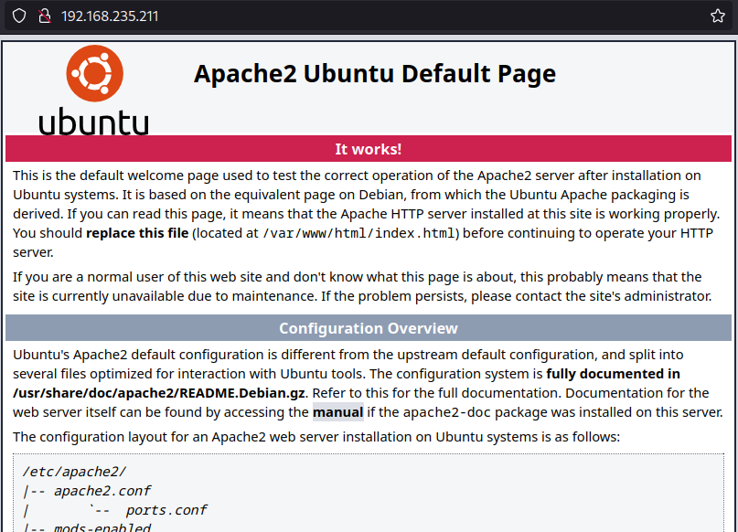
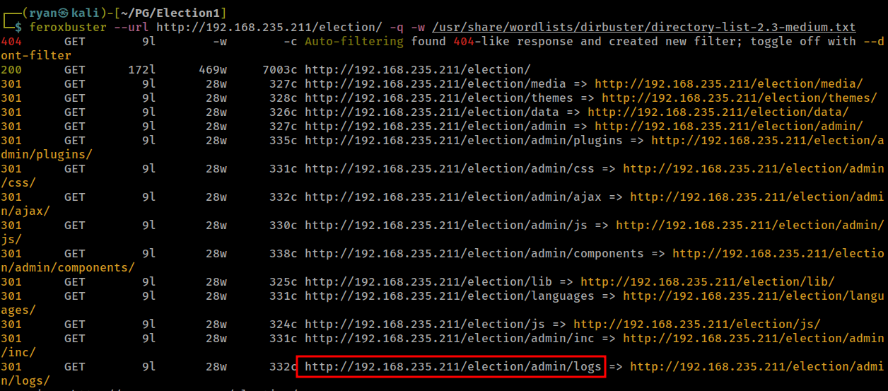
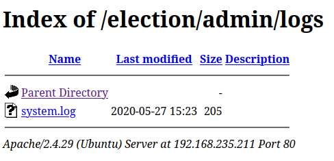
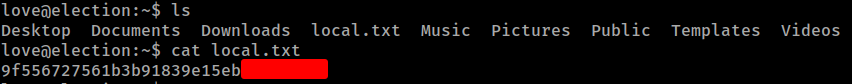
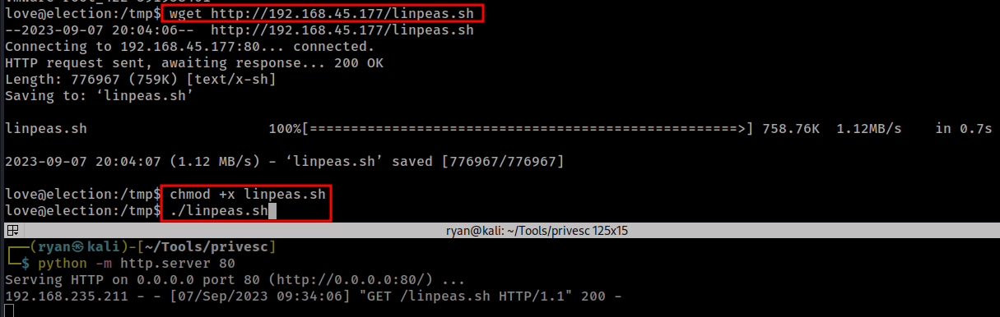
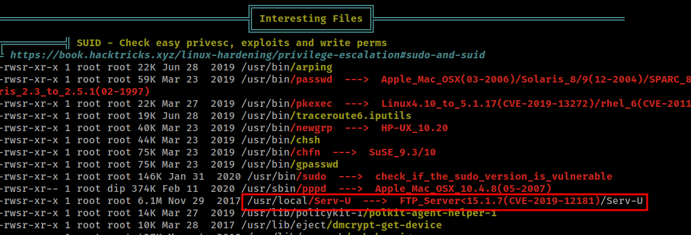
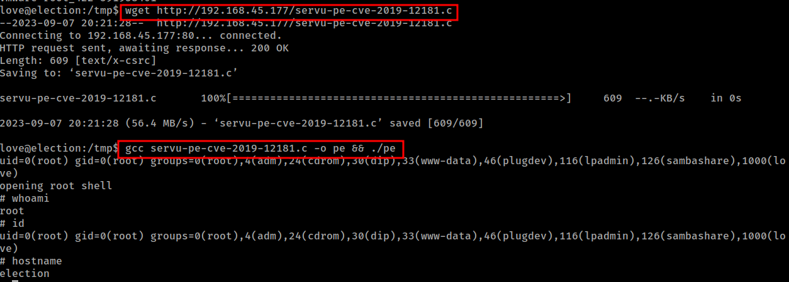
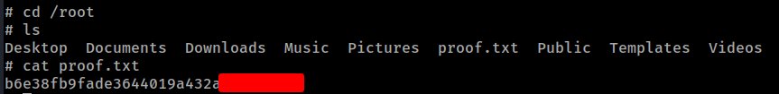

# PG Play - Election1

#### Ip: 192.168.235.211
#### Name: Election1
#### Difficulty: Intermediate
#### Community Rating: Intermediate

----------------------------------------------------------------------

### Enumeration

I'll kick off enumerating this box with an Nmap scan covering all TCP ports. Here I'll also use the `-sC` and `-sV` flags to use basic scripts and to enumerate versions.

```text
┌──(ryan㉿kali)-[~/PG/Election1]
└─$ sudo nmap -p-  --min-rate 10000 192.168.235.211 -sC -sV
[sudo] password for ryan: 
Starting Nmap 7.93 ( https://nmap.org ) at 2023-09-07 09:21 CDT
Nmap scan report for 192.168.235.211
Host is up (0.068s latency).
Not shown: 65533 closed tcp ports (reset)
PORT   STATE SERVICE VERSION
22/tcp open  ssh     OpenSSH 7.6p1 Ubuntu 4ubuntu0.3 (Ubuntu Linux; protocol 2.0)
| ssh-hostkey: 
|   2048 20d1ed84cc68a5a786f0dab8923fd967 (RSA)
|   256 7889b3a2751276922af98d27c108a7b9 (ECDSA)
|_  256 b8f4d661cf1690c5071899b07c70fdc0 (ED25519)
80/tcp open  http    Apache httpd 2.4.29 ((Ubuntu))
|_http-title: Apache2 Ubuntu Default Page: It works
|_http-server-header: Apache/2.4.29 (Ubuntu)
Service Info: OS: Linux; CPE: cpe:/o:linux:linux_kernel

Service detection performed. Please report any incorrect results at https://nmap.org/submit/ .
Nmap done: 1 IP address (1 host up) scanned in 15.37 seconds

```

Heading to the site on port 80 we find a default Apache landing page:



But manually checking for http://192.168.235.211/robots.txt we find a few entries:

```text
admin
wordpress
user
election
```

Navigating to http://192.168.235.211/election/ we find one election candidate named Love:


Kicking off some directory fuzzing against http://192.168.235.211/election/ we find `/admin/logs` which seems interesting. 





Downloading the .log file we find love's credentials:

```text
┌──(ryan㉿kali)-[~/PG/Election1]
└─$ cat system.log 
[2020-01-01 00:00:00] Assigned Password for the user love: P@$$w0rd@123
[2020-04-03 00:13:53] Love added candidate 'Love'.
[2020-04-08 19:26:34] Love has been logged in from Unknown IP on Firefox (Linux).
```

### Exploitation

Cool, we were able to use these credentials to SSH in as the user love:

```text
┌──(ryan㉿kali)-[~/PG/Election1]
└─$ ssh love@192.168.235.211                               
The authenticity of host '192.168.235.211 (192.168.235.211)' can't be established.
ED25519 key fingerprint is SHA256:z1Xg/pSBrK8rLIMLyeb0L7CS1YL4g7BgCK95moiAYhQ.
This key is not known by any other names.
Are you sure you want to continue connecting (yes/no/[fingerprint])? yes
Warning: Permanently added '192.168.235.211' (ED25519) to the list of known hosts.
love@192.168.235.211's password: 
Welcome to Ubuntu 18.04.4 LTS (GNU/Linux 5.4.0-120-generic x86_64)

 * Documentation:  https://help.ubuntu.com
 * Management:     https://landscape.canonical.com
 * Support:        https://ubuntu.com/advantage


 * Canonical Livepatch is available for installation.
   - Reduce system reboots and improve kernel security. Activate at:
     https://ubuntu.com/livepatch

471 packages can be updated.
358 updates are security updates.

Failed to connect to https://changelogs.ubuntu.com/meta-release-lts. Check your Internet connection or proxy settings

Your Hardware Enablement Stack (HWE) is supported until April 2023.
Last login: Thu Apr  9 23:19:28 2020 from 192.168.1.5
love@election:~$ whoami
love
love@election:~$ hostname
election
```

We can now grab the local.txt flag:



### Privilege Escalation

Lets go ahead and transfer over LinPEAS to help with enumerating a priveilege escalation vector:



LinPEAS finds an interesting service worth looking into:



Searching for CVE-2019-12181 I find this exploit: https://www.exploit-db.com/exploits/47009

This seems promising. Lets copy the exploit to the target, compile it there, and run it.



Nice, that worked! 

All we need to do now is grab the proof.txt flag:



Thanks for following along!

-Ryan

----------------------------------------------------------
